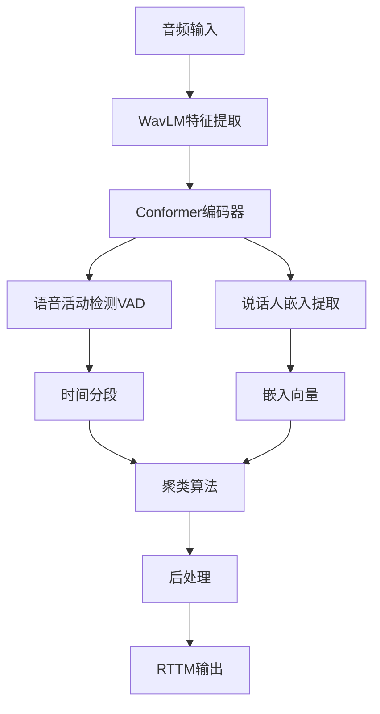

# DiariZen 详尽技术文档

## 目录

1. [项目概述](#项目概述)
2. [项目架构详解](#项目架构详解)
   - [DiariZen目录结构](#diarizen目录结构)
   - [pyannote-audio目录结构](#pyannote-audio目录结构)
   - [模型架构详解](#模型架构详解)
   - [训练流程详解](#训练流程详解)
   - [推理流程详解](#推理流程详解)
3. [环境配置与安装](#环境配置与安装)
4. [核心架构原理](#核心架构原理)
5. [快速开始](#快速开始)
6. [API详细说明](#api详细说明)
7. [训练流程](#训练流程)
8. [模型剪枝](#模型剪枝)
9. [评估与基准测试](#评估与基准测试)
10. [高级配置](#高级配置)
11. [常见问题](#常见问题)
12. [开发者指南](#开发者指南)
13. [性能优化](#性能优化)

---

## 项目概述

### 什么是DiariZen？

DiariZen是一个基于深度学习的**说话人分离（Speaker Diarization）**工具包，它能够回答"谁在什么时候说话"这个问题。

**说话人分离**是指从包含多个说话人的音频录音中，自动识别出：
- 音频中有几个不同的说话人
- 每个时间段是哪个说话人在说话
- 输出时间轴标注（如：0-5秒是人A，5-8秒是人B）

### 技术特点

#### 🚀 核心优势
- **自监督学习**：基于Microsoft WavLM预训练模型，理解语音语义
- **端到端训练**：从原始音频直接到说话人标注，无需手工特征
- **高性能**：在多个基准数据集上超越业界标准Pyannote 3.1
- **模型压缩**：支持结构化剪枝，模型大小减少80-90%而性能几乎不变
- **易用性**：提供简洁的Python API和预训练模型

#### 📊 性能表现
| 数据集 | Pyannote v3.1 | DiariZen-Base | DiariZen-Large | 相对改进 |
|--------|---------------|---------------|----------------|----------|
| AMI-SDM | 22.4% | 15.8% | **14.0%** | **37.5%** |
| AISHELL-4 | 12.2% | 10.7% | **9.8%** | **19.7%** |
| AliMeeting | 24.4% | 14.1% | **12.5%** | **48.8%** |
| VoxConverse | 11.3% | 9.7% | **9.2%** | **18.6%** |

#### 🏗️ 技术架构
```
原始音频 → WavLM特征提取 → Conformer编码 → 语音活动检测 → 说话人嵌入 → 聚类 → 分离结果
```

---

## 项目架构详解

### DiariZen目录结构

DiariZen项目采用了模块化的设计，将不同功能组件分离到独立的目录中。以下是项目的主要目录结构：

#### 根目录结构
```
DiariZen/
├── diarizen/                    # 核心DiariZen代码包
├── pyannote-audio/              # pyannote音频处理库（子模块）
├── recipes/                     # 训练配置和脚本
├── cache/                       # 模型缓存目录
├── dscore/                      # 评估工具
├── example/                     # 示例数据
├── batch_diarize_*.py           # 批量处理脚本
├── quick_start.py               # 快速开始脚本
├── requirements.txt             # 依赖列表
└── pyproject.toml               # 项目配置
```

#### diarizen/ 核心包结构
```
diarizen/
├── __init__.py                  # 包初始化
├── models/                      # 模型定义
│   ├── __init__.py
│   ├── eend/                    # 端到端模型
│   │   ├── model_wavlm_conformer.py    # WavLM+Conformer模型
│   │   ├── model_fbank_conformer.py    # FBank+Conformer模型
│   │   └── model_pyannote.py            # pyannote兼容模型
│   ├── module/                  # 基础模块
│   │   ├── conformer.py         # Conformer编码器
│   │   ├── wavlm_config.py      # WavLM配置
│   │   ├── wav2vec2/            # wav2vec2相关模块
│   │   └── speechbrain_feats.py # 语音特征提取
│   └── pruning/                 # 模型剪枝
│       ├── model_distill_prune.py
│       └── utils.py
├── pipelines/                   # 推理管道
│   ├── __init__.py
│   ├── inference.py             # 推理管道实现
│   └── utils.py                 # 管道工具函数
├── clustering/                  # 聚类算法
│   └── VBx.py                   # VBx变分贝叶斯聚类
├── trainer_*.py                 # 训练器
│   ├── trainer_dual_opt.py      # 双优化器训练器
│   ├── trainer_single_opt.py    # 单优化器训练器
│   └── trainer_distill_prune.py # 蒸馏剪枝训练器
├── utils.py                     # 通用工具函数
├── logger.py                    # 日志工具
├── optimization.py              # 优化相关
├── ckpt_utils.py                # 检查点工具
└── noam_updater.py              # Noam学习率调度
```

#### recipes/ 配置和脚本
```
recipes/
├── diar_ssl/                    # 自监督说话人分离
│   ├── conf/                    # 配置文件
│   │   ├── wavlm_updated_conformer.toml    # WavLM+Conformer配置
│   │   ├── fbank_conformer.toml           # FBank+Conformer配置
│   │   ├── wavlm_frozen_conformer.toml    # 冻结WavLM配置
│   │   └── pyannote_baseline.toml         # pyannote基线配置
│   ├── run_dual_opt.py          # 双优化器训练脚本
│   ├── run_single_opt.py        # 单优化器训练脚本
│   ├── dataset.py               # 数据集定义
│   └── README.md
└── diar_ssl_pruning/            # 剪枝版本
    ├── conf/                    # 剪枝配置文件
    ├── run_distill_prune.py     # 蒸馏剪枝训练脚本
    ├── apply_pruning.py         # 应用剪枝脚本
    └── get_wavlm_from_finetuned.py
```

### pyannote-audio目录结构

pyannote-audio是DiariZen的基础音频处理库，提供了完整的说话人分离管道。以下是其详细目录结构：

#### pyannote/audio/ 主包结构
```
pyannote/audio/
├── __init__.py
├── core/                        # 核心组件
│   ├── __init__.py
│   ├── model.py                 # 基础模型类
│   ├── pipeline.py              # 管道基类
│   ├── inference.py             # 推理引擎
│   ├── io.py                    # 输入输出处理
│   └── callback.py              # 回调机制
├── models/                      # 预训练模型
│   ├── __init__.py
│   ├── segmentation/            # 分割模型
│   │   ├── PyanNet.py           # PyanNet分割模型
│   │   └── SSeRiouSS.py         # SSeRiouSS分割模型
│   ├── embedding/               # 嵌入模型
│   │   ├── wespeaker/           # WeSpeaker嵌入
│   │   │   ├── resnet.py        # ResNet骨干网络
│   │   │   ├── convert.py       # 模型转换工具
│   │   │   └── LICENSE.WeSpeaker
│   │   └── xvector.py           # X-Vector嵌入
│   └── blocks/                  # 基础构建块
│       ├── pooling.py           # 池化层
│       └── sincnet.py           # SincNet卷积
├── pipelines/                   # 处理管道
│   ├── __init__.py
│   ├── speaker_diarization.py   # 说话人分离管道 ⭐⭐⭐
│   ├── clustering.py            # 聚类算法
│   ├── speaker_verification.py  # 说话人验证
│   ├── voice_activity_detection.py # VAD检测
│   ├── multilabel.py            # 多标签处理
│   ├── resegmentation.py        # 重分割
│   ├── overlapped_speech_detection.py # 重叠语音检测
│   └── utils/                   # 管道工具
│       ├── diarization.py       # 说话人分离工具
│       ├── getter.py            # 模型获取器
│       ├── hook.py              # 钩子函数
│       └── oracle.py            # 预言机评估
├── tasks/                       # 任务定义
│   ├── __init__.py
│   ├── segmentation/            # 分割任务
│   │   ├── speaker_diarization.py   # 说话人分离任务
│   │   ├── voice_activity_detection.py # VAD任务
│   │   ├── overlapped_speech_detection.py # OSD任务
│   │   └── multilabel.py        # 多标签分割任务
│   └── embedding/               # 嵌入任务
│       ├── arcface.py           # ArcFace损失
│       └── mixins.py            # 任务混入
├── torchmetrics/                # PyTorch指标
│   ├── __init__.py
│   ├── audio/                   # 音频指标
│   │   └── diarization_error_rate.py # DER指标
│   └── classification/          # 分类指标
│       └── equal_error_rate.py  # EER指标
├── utils/                       # 工具函数
│   ├── __init__.py
│   ├── loss.py                  # 损失函数
│   ├── metric.py                # 评估指标
│   ├── multi_task.py            # 多任务处理
│   ├── params.py                # 参数管理
│   ├── permutation.py           # 排列工具
│   ├── powerset.py              # 幂集编码
│   ├── preprocessors.py         # 预处理器
│   ├── preview.py               # 预览工具
│   ├── probe.py                 # 探针工具
│   ├── protocol.py              # 协议定义
│   ├── random.py                # 随机工具
│   ├── receptive_field.py       # 感受野计算
│   ├── reproducibility.py       # 可重复性
│   ├── signal.py                # 信号处理
│   └── version.py               # 版本管理
├── cli/                         # 命令行接口
│   ├── __init__.py
│   ├── evaluate.py              # 评估命令
│   ├── pretrained.py            # 预训练模型管理
│   └── train.py                 # 训练命令
└── sample/                      # 示例数据
    ├── sample.wav
    └── sample.rttm
```

#### 各子系统详解

### 🎯 核心系统 (core/)

pyannote-audio的核心系统提供了统一的接口和抽象：

**Model类** (`core/model.py`):
- **作用**: 定义了所有音频模型的基类
- **关键特性**:
  - 统一的模型接口
  - 自动参数管理
  - 任务规格定义
  - 感受野计算

**Pipeline类** (`core/pipeline.py`):
- **作用**: 提供可配置的处理管道框架
- **关键特性**:
  - 参数化配置
  - 自动参数优化
  - 批量处理支持
  - 错误处理机制

**Inference类** (`core/inference.py`):
- **作用**: 统一的模型推理引擎
- **关键特性**:
  - 滑动窗口推理
  - 批处理优化
  - 设备管理
  - 内存优化

### 🧠 模型系统 (models/)

**分割模型** (`models/segmentation/`):
- **PyanNet**: 基于TCN的轻量级分割模型
- **SSeRiouSS**: 基于ResNet的高精度分割模型
- **共同特性**:
  - 多标签分割输出
  - 幂集编码支持
  - 时序建模能力

**嵌入模型** (`models/embedding/`):
- **WeSpeaker ResNet**: 大规模预训练嵌入模型
- **X-Vector**: 传统但有效的嵌入方法
- **共同特性**:
  - 说话人表征学习
  - 相似度度量
  - 聚类友好

### 🔧 管道系统 (pipelines/)

**SpeakerDiarization管道** (`pipelines/speaker_diarization.py`):
这是DiariZen的核心管道，实现了完整的说话人分离流程：

```python
class SpeakerDiarization(SpeakerDiarizationMixin, Pipeline):
    """说话人分离管道的核心实现"""
```

**管道流程**:
1. **语音活动检测**: 识别有声段
2. **说话人分割**: 将音频分为说话人片段
3. **嵌入提取**: 为每个片段生成说话人嵌入
4. **聚类**: 将相似嵌入归类为同一说话人
5. **后处理**: 优化和格式化结果

**聚类算法** (`pipelines/clustering.py`):
- **AgglomerativeClustering**: 层次聚类，快速且稳定
- **VBxClustering**: 变分贝叶斯聚类，准确但较慢
- **选择策略**: 基于音频时长和准确性需求选择

### 📋 任务系统 (tasks/)

**分割任务** (`tasks/segmentation/`):
- **SpeakerDiarization**: 多说话人场景的分割
- **VoiceActivityDetection**: 单说话人语音检测
- **OverlappedSpeechDetection**: 重叠语音检测

**嵌入任务** (`tasks/embedding/`):
- **SpeakerEmbedding**: 说话人表征学习
- **ArcFace**: 分类友好的度量学习

### 📊 评估系统 (torchmetrics/)

**DER (Diarization Error Rate)**:
- **计算公式**: DER = (FA + MISS + CONFUSION) / TOTAL_SPEECH_TIME
- **组成部分**:
  - FA (False Alarm): 误检时间
  - MISS: 漏检时间
  - CONFUSION: 说话人混淆时间

---

### 模型架构详解

#### DiariZen模型架构

DiariZen的核心创新在于将WavLM预训练模型与Conformer编码器相结合，采用端到端的说话人分离架构。

##### 整体架构图
```
原始音频 (16kHz)
    ↓
WavLM特征提取器 (13层Transformer)
    ↓
多层特征融合 (加权求和)
    ↓
线性投影 (768→256维)
    ↓
LayerNorm归一化
    ↓
Conformer编码器 (4层)
    ↓
分类器 (256→幂集类别)
    ↓
多标签二元交叉熵损失
```

##### WavLM特征提取器详解

**WavLM (Wav Large Model)** 是Microsoft开发的 wav2vec 2.0 的升级版本：

```python
class WavLMFeatureExtractor:
    def __init__(self, model_path, layer_num=13):
        # 加载预训练WavLM模型
        self.model = self.load_wavlm_model(model_path)
        self.layer_num = layer_num
        
        # 层级权重学习器
        self.layer_weights = nn.Linear(layer_num, 1, bias=False)
        
    def forward(self, waveform):
        # 提取多层特征
        all_layer_outputs = []
        for i in range(self.layer_num):
            layer_output = self.model.extract_features(waveform, layer=i)
            all_layer_outputs.append(layer_output)
        
        # 学习最优层级组合
        stacked_features = torch.stack(all_layer_outputs, dim=-1)  # [B, T, D, L]
        weights = self.layer_weights.weight  # [1, L]
        weighted_features = torch.matmul(stacked_features, weights.t())  # [B, T, D]
        
        return weighted_features
```

**WavLM关键特性**:
- **13层Transformer编码器**
- **768维特征输出**
- **自监督预训练**: 在海量无标注音频上训练
- **多任务学习**: 同时学习内容和说话人特征

##### Conformer编码器详解

Conformer结合了CNN的局部建模和Transformer的全局建模能力：

```python
class ConformerEncoder(nn.Module):
    def __init__(self, attention_in=256, ffn_hidden=1024, num_head=4, num_layer=4):
        super().__init__()
        
        self.layers = nn.ModuleList([
            ConformerBlock(
                dim=attention_in,
                ffn_dim=ffn_hidden,
                num_heads=num_head,
                conv_kernel_size=31,
                dropout=0.1
            ) for _ in range(num_layer)
        ])
        
    def forward(self, x):
        for layer in self.layers:
            x = layer(x)  # 每个Conformer块的处理
        return x
```

**ConformerBlock结构**:
```
输入特征
    ↓
多头自注意力 (Multi-Head Self Attention)
    ↓
残差连接 + 层归一化
    ↓
前馈网络 (Feed Forward Network)
    ↓
残差连接 + 层归一化
    ↓
卷积模块 (Convolution Module)
    ↓
残差连接 + 层归一化
    ↓
输出
```

##### 幂集编码 (Powerset Encoding)

DiariZen采用幂集编码来处理多说话人场景：

```python
class PowersetEncoding:
    def __init__(self, max_speakers=4):
        self.max_speakers = max_speakers
        self.num_classes = 2 ** max_speakers  # 2^4 = 16个类别
        
    def encode(self, speaker_labels):
        """将说话人标签编码为幂集索引"""
        # speaker_labels: [B, T, max_speakers] 二进制矩阵
        # 返回: [B, T] 类别索引 (0-15)
        
        powers = 2 ** torch.arange(self.max_speakers)
        indices = torch.sum(speaker_labels * powers, dim=-1)
        return indices
        
    def decode(self, class_logits):
        """将分类logits解码为说话人概率"""
        # class_logits: [B, T, num_classes]
        # 返回: [B, T, max_speakers] 说话人存在概率
        
        # 将每个类别映射回二进制向量
        binary_matrix = self._logits_to_binary(class_logits)
        return binary_matrix
```

**幂集编码优势**:
- **显式建模重叠**: 可以准确表示多个说话人同时说话
- **端到端训练**: 无需复杂的后处理
- **计算效率**: 分类任务比回归任务更稳定

#### 双优化器训练策略

DiariZen采用创新的双优化器设计来平衡预训练模型微调和新任务学习：

```python
class DualOptimizerTrainer:
    def __init__(self, model):
        # 小学习率优化器：用于WavLM微调
        self.optimizer_small = AdamW(
            params=model.wavlm_model.parameters(),
            lr=2e-5,  # 微调学习率
            weight_decay=0.01
        )
        
        # 大学习率优化器：用于新组件训练
        self.optimizer_big = AdamW(
            params=model.non_wavlm_parameters(),
            lr=1e-3,   # 从头训练学习率
            weight_decay=0.01
        )
    
    def step(self, loss):
        # 小优化器步骤
        self.optimizer_small.zero_grad()
        loss.backward(retain_graph=True)
        self.optimizer_small.step()
        
        # 大优化器步骤
        self.optimizer_big.zero_grad()
        loss.backward()
        self.optimizer_big.step()
```

**设计原理**:
- **预训练部分(WavLM)**: 已经学会通用语音表示，只需小幅调整
- **新增部分(Conformer+分类器)**: 从零开始学习说话人分离任务
- **学习率差异**: 相差50倍，适应不同组件的学习需求

---

### 训练流程详解

#### 数据准备流程

DiariZen的训练需要三种核心数据文件：

**1. 音频列表文件 (wav.scp)**:
```
session_id1 /path/to/audio1.wav
session_id2 /path/to/audio2.wav
session_id3 /path/to/audio3.wav
```

**2. 标注文件 (rttm)**:
```
SPEAKER session_id1 1 0.00 2.50 <NA> <NA> spk1 <NA> <NA>
SPEAKER session_id1 1 2.50 1.80 <NA> <NA> spk2 <NA> <NA>
SPEAKER session_id1 1 4.30 3.20 <NA> <NA> spk1 <NA> <NA>
```

**RTTM格式详解**:
- **SPEAKER**: 记录类型标识符
- **session_id1**: 会话ID
- **1**: 文件编号（通常为1）
- **0.00**: 开始时间（秒）
- **2.50**: 持续时间（秒）
- **spk1**: 说话人标签

**3. 评估段标记 (uem)**:
```
session_id1 1 0.00 30.00
session_id2 1 0.00 45.20
```
定义需要评估的时间段。

#### 数据加载和预处理

```python
class DiarizationDataset(torch.utils.data.Dataset):
    def __init__(self, scp_file, rttm_file, uem_file, chunk_size=8, chunk_shift=6):
        self.chunk_size = chunk_size  # 块大小（秒）
        self.chunk_shift = chunk_shift  # 块偏移（秒）
        self.sample_rate = 16000
        
        # 加载音频路径
        self.audio_paths = self.load_scp(scp_file)
        
        # 加载标注
        self.annotations = self.load_rttm(rttm_file)
        
        # 加载评估段
        self.uem_segments = self.load_uem(uem_file)
        
        # 生成训练块
        self.chunks = self.generate_chunks()
    
    def __getitem__(self, idx):
        chunk_info = self.chunks[idx]
        
        # 加载音频块
        audio_chunk = self.load_audio_chunk(chunk_info)
        
        # 加载对应标注
        labels = self.load_labels_for_chunk(chunk_info)
        
        return audio_chunk, labels
```

#### 训练循环详解

```python
def training_epoch(model, dataloader, optimizer_small, optimizer_big, device):
    model.train()
    
    for batch_idx, (waveforms, labels) in enumerate(dataloader):
        waveforms = waveforms.to(device)  # [B, 1, T]
        labels = labels.to(device)        # [B, T, num_classes]
        
        # 前向传播
        logits = model(waveforms)  # [B, T, num_classes]
        
        # 计算损失
        loss = F.binary_cross_entropy_with_logits(
            logits.view(-1, logits.size(-1)),
            labels.view(-1, labels.size(-1))
        )
        
        # 双优化器更新
        optimizer_small.zero_grad()
        optimizer_big.zero_grad()
        
        loss.backward()
        
        # 梯度裁剪
        torch.nn.utils.clip_grad_norm_(model.parameters(), max_norm=1.0)
        
        optimizer_small.step()
        optimizer_big.step()
        
        # 日志记录
        if batch_idx % 100 == 0:
            print(f"Batch {batch_idx}, Loss: {loss.item():.4f}")
```

#### 验证流程

```python
def validation_epoch(model, dataloader, device):
    model.eval()
    
    total_der = 0
    num_sessions = 0
    
    with torch.no_grad():
        for waveforms, labels, session_ids in dataloader:
            # 批量推理
            predictions = model(waveforms.to(device))
            
            # 计算DER
            for pred, label, session_id in zip(predictions, labels, session_ids):
                der = calculate_der_for_session(pred, label)
                total_der += der
                num_sessions += 1
    
    avg_der = total_der / num_sessions
    return avg_der
```

---

### 推理流程详解

#### DiariZenPipeline架构

DiariZenPipeline继承自pyannote-audio的SpeakerDiarization管道，并定制了推理流程：

```python
class DiariZenPipeline(SpeakerDiarization):
    def __init__(self, diarizen_hub, embedding_model, config_parse=None):
        # 加载DiariZen分割模型
        segmentation_model = self.load_segmentation_model(diarizen_hub)
        
        # 初始化父类
        super().__init__(
            segmentation=segmentation_model,
            embedding=embedding_model,
            clustering="VBxClustering",  # 或 "AgglomerativeClustering"
            embedding_exclude_overlap=True,
            device=torch.device("cuda" if torch.cuda.is_available() else "cpu")
        )
        
        # 自定义参数
        self.apply_median_filtering = True
        self.min_speakers = 1
        self.max_speakers = 20
```

#### 推理步骤详解

**步骤1: 音频预处理**
```python
def preprocess_audio(self, audio_file):
    """音频预处理"""
    # 加载音频
    waveform, sample_rate = torchaudio.load(audio_file)
    
    # 重采样到16kHz
    if sample_rate != 16000:
        resampler = torchaudio.transforms.Resample(sample_rate, 16000)
        waveform = resampler(waveform)
    
    # 转换为单声道
    if waveform.shape[0] > 1:
        waveform = waveform.mean(dim=0, keepdim=True)
    
    return waveform.squeeze(0)  # [T]
```

**步骤2: 滑动窗口分割**
```python
def sliding_window_segmentation(self, waveform, step_ratio=0.1):
    """滑动窗口分割推理"""
    
    # 模型期望的块大小
    chunk_duration = self.segmentation.model.chunk_size  # 8秒
    sample_rate = self.segmentation.model.sample_rate     # 16000Hz
    chunk_samples = int(chunk_duration * sample_rate)    # 128000样本
    
    # 滑动步长
    step_samples = int(chunk_samples * step_ratio)  # 12800样本
    
    segments = []
    start_sample = 0
    
    while start_sample < len(waveform):
        end_sample = min(start_sample + chunk_samples, len(waveform))
        
        # 提取音频块
        chunk = waveform[start_sample:end_sample]
        
        # 填充到固定长度
        if len(chunk) < chunk_samples:
            padding = torch.zeros(chunk_samples - len(chunk))
            chunk = torch.cat([chunk, padding])
        
        segments.append({
            'audio': chunk,
            'start_time': start_sample / sample_rate,
            'end_time': end_sample / sample_rate
        })
        
        start_sample += step_samples
    
    return segments
```

**步骤3: 批量分割推理**
```python
def batch_segmentation_inference(self, audio_segments, batch_size=32):
    """批量分割模型推理"""
    
    all_segmentations = []
    
    for i in range(0, len(audio_segments), batch_size):
        batch_segments = audio_segments[i:i+batch_size]
        
        # 准备批次数据
        batch_audio = torch.stack([seg['audio'] for seg in batch_segments])
        batch_audio = batch_audio.unsqueeze(1)  # [B, 1, T]
        
        # 模型推理
        with torch.no_grad():
            batch_logits = self.segmentation.model(batch_audio.to(self.device))
            batch_probs = torch.sigmoid(batch_logits)
        
        # 解码为分割结果
        for j, seg in enumerate(batch_segments):
            probs = batch_probs[j]  # [T, num_classes]
            
            # 幂集解码为说话人活动
            speaker_activities = self.decode_powerset(probs)
            
            segmentation = {
                'start_time': seg['start_time'],
                'end_time': seg['end_time'],
                'speaker_activities': speaker_activities  # [T, max_speakers]
            }
            
            all_segmentations.append(segmentation)
    
    return all_segmentations
```

**步骤4: 嵌入提取**
```python
def extract_embeddings(self, segmentations, waveform):
    """提取说话人嵌入"""
    
    embeddings = []
    segments_for_embedding = []
    
    for seg in segmentations:
        # 找到有声段
        speaker_activities = seg['speaker_activities']
        
        for speaker_idx in range(speaker_activities.shape[1]):
            speaker_activity = speaker_activities[:, speaker_idx]
            
            # 检测说话人活动段
            active_frames = speaker_activity > 0.5
            if active_frames.sum() > 0:
                # 计算时间边界
                start_frame = active_frames.nonzero()[0, 0]
                end_frame = active_frames.nonzero()[-1, 0]
                
                start_time = seg['start_time'] + start_frame * self.segmentation.model.get_rf_info()[2]
                end_time = seg['start_time'] + (end_frame + 1) * self.segmentation.model.get_rf_info()[2]
                
                segments_for_embedding.append({
                    'start': start_time,
                    'end': end_time,
                    'speaker_idx': speaker_idx
                })
    
    # 批量提取嵌入
    if segments_for_embedding:
        batch_embeddings = self.embedding_model(waveform, segments_for_embedding)
        embeddings.extend(batch_embeddings)
    
    return embeddings, segments_for_embedding
```

**步骤5: 聚类和后处理**
```python
def clustering_and_postprocessing(self, embeddings, segments):
    """聚类和后处理"""
    
    # 准备聚类输入
    embedding_vectors = torch.stack([emb['embedding'] for emb in embeddings])
    
    # 执行聚类
    if self.clustering_method == "VBxClustering":
        cluster_labels = self.vbx_clustering(embedding_vectors)
    else:
        cluster_labels = self.agglomerative_clustering(embedding_vectors)
    
    # 生成最终结果
    diarization_result = self.create_diarization_annotation(
        segments, cluster_labels
    )
    
    # 中值滤波平滑
    if self.apply_median_filtering:
        diarization_result = self.median_filter(diarization_result)
    
    return diarization_result
```

#### 性能优化策略

**1. 批处理优化**
```python
def optimized_batch_inference(self, audio_file, batch_size=64):
    """优化的批处理推理"""
    
    # 预加载和预处理
    waveform = self.preprocess_audio(audio_file)
    audio_segments = self.sliding_window_segmentation(waveform)
    
    # 使用更大的批处理大小
    all_segmentations = self.batch_segmentation_inference(
        audio_segments, batch_size=batch_size
    )
    
    # 并行嵌入提取
    embeddings, segments = self.parallel_embedding_extraction(
        all_segmentations, waveform
    )
    
    return self.clustering_and_postprocessing(embeddings, segments)
```

**2. 内存管理**
```python
def memory_efficient_inference(self, audio_file):
    """内存高效推理"""
    
    # 分块处理长音频
    waveform = self.preprocess_audio(audio_file)
    max_chunk_duration = 300  # 5分钟块
    
    results = []
    for start_time in range(0, len(waveform) // 16000, max_chunk_duration):
        end_time = min(start_time + max_chunk_duration, len(waveform) // 16000)
        
        # 处理音频块
        chunk_waveform = waveform[start_time*16000:end_time*16000]
        chunk_result = self.process_chunk(chunk_waveform, start_time)
        results.append(chunk_result)
        
        # 清理GPU内存
        torch.cuda.empty_cache()
    
    # 合并结果
    return self.merge_chunk_results(results)
```

---

## 环境配置与安装

### 系统要求
- **操作系统**：Linux/macOS/Windows
- **Python版本**：≥ 3.10
- **GPU**：推荐NVIDIA GPU（支持CUDA 12.1）
- **内存**：≥ 16GB RAM
- **存储**：≥ 10GB 可用空间

### 安装步骤

#### 1. 创建虚拟环境
```bash
# 使用conda创建环境
conda create --name diarizen python=3.10
conda activate diarizen
```

#### 2. 安装PyTorch
```bash
# 根据你的CUDA版本调整
conda install pytorch==2.1.1 torchvision==0.16.1 torchaudio==2.1.1 pytorch-cuda=12.1 -c pytorch -c nvidia

# 如果没有GPU，使用CPU版本
# conda install pytorch==2.1.1 torchvision==0.16.1 torchaudio==2.1.1 cpuonly -c pytorch
```

#### 3. 安装DiariZen
```bash
# 克隆仓库
git clone https://github.com/BUTSpeechFIT/DiariZen.git
cd DiariZen

# 安装依赖
pip install -r requirements.txt && pip install -e .

# 安装pyannote-audio
cd pyannote-audio && pip install -e .[dev,testing]
cd ..

# 初始化子模块
git submodule init
git submodule update
```

#### 4. 验证安装
```python
# 测试安装是否成功
from diarizen.pipelines.inference import DiariZenPipeline
print("DiariZen安装成功！")
```

### Docker安装（推荐）
```dockerfile
# Dockerfile示例
FROM pytorch/pytorch:2.1.1-cuda12.1-cudnn8-devel

WORKDIR /workspace
COPY . .

RUN pip install -r requirements.txt && pip install -e .
RUN cd pyannote-audio && pip install -e .[dev,testing]

CMD ["python", "-c", "from diarizen.pipelines.inference import DiariZenPipeline; print('Ready!')"]
```

---

## 核心架构原理

### 整体流程图


### 1. 特征提取模块

#### WavLM预训练模型详解

**WavLM架构**：
```python
class WavLMFeatureExtractor(nn.Module):
    def __init__(self, model_path, layer_num=13, feature_dim=768):
        super().__init__()

        # 加载预训练WavLM模型
        self.wavlm = self.load_pretrained_wavlm(model_path)
        self.layer_num = layer_num
        self.feature_dim = feature_dim

        # 可学习的多层特征融合
        self.layer_weighting = nn.Linear(layer_num, 1, bias=False)

        # 初始化权重为均匀分布
        nn.init.uniform_(self.layer_weighting.weight, -0.1, 0.1)

    def forward(self, waveform):
        """
        Args:
            waveform: [B, T] 原始音频波形
        Returns:
            features: [B, T', D] 融合后的特征
        """

        # 提取所有层的特征
        all_layer_features = []
        for layer_idx in range(self.layer_num):
            # WavLM前向传播，指定输出层
            layer_output = self.wavlm.extract_features(
                waveform,
                output_layer=layer_idx,
                mask=False  # 推理时关闭masking
            )[0]  # [B, T', D]

            all_layer_features.append(layer_output)

        # 堆叠所有层特征: [B, T', D, L]
        stacked_features = torch.stack(all_layer_features, dim=-1)

        # 学习最优层级权重: [L, 1] -> [1, L]
        layer_weights = self.layer_weighting.weight.t()
        layer_weights = F.softmax(layer_weights / 0.1, dim=0)  # 温度缩放

        # 加权融合: [B, T', D, L] * [L, 1] -> [B, T', D]
        fused_features = torch.matmul(stacked_features, layer_weights)

        return fused_features
```

**WavLM关键创新**：
1. **多任务预训练**：
   - 掩码语言建模 (Masked Language Modeling)
   - 对比学习 (Contrastive Learning)
   - 去噪自编码 (Denoising Autoencoding)

2. **分层特征表示**：
   - **底层(0-3)**: 声学特征 (phonetic features)
   - **中层(4-8)**: 语义特征 (semantic features)
   - **高层(9-12)**: 说话人特征 (speaker features)

3. **相对位置编码**：
   - 比绝对位置编码更适合变长音频
   - 支持任意长度的序列推理

#### Conformer编码器详解

**Conformer Block架构**：
```python
class ConformerBlock(nn.Module):
    def __init__(self, dim=256, ffn_dim=1024, num_heads=4, kernel_size=31, dropout=0.1):
        super().__init__()

        # 1. 前馈网络模块 (Feed Forward Module)
        self.ffn1 = nn.Sequential(
            nn.LayerNorm(dim),
            nn.Linear(dim, ffn_dim),
            nn.SiLU(),  # Swish激活函数
            nn.Dropout(dropout),
            nn.Linear(ffn_dim, dim),
            nn.Dropout(dropout)
        )

        # 2. 多头自注意力模块 (Multi-Head Self Attention)
        self.self_attn = nn.MultiheadAttention(
            embed_dim=dim,
            num_heads=num_heads,
            dropout=dropout,
            batch_first=True
        )
        self.self_attn_norm = nn.LayerNorm(dim)

        # 3. 卷积模块 (Convolution Module)
        self.conv_module = ConvolutionModule(
            dim=dim,
            kernel_size=kernel_size,
            dropout=dropout
        )

        # 4. 第二前馈网络模块
        self.ffn2 = nn.Sequential(
            nn.LayerNorm(dim),
            nn.Linear(dim, ffn_dim),
            nn.SiLU(),
            nn.Dropout(dropout),
            nn.Linear(ffn_dim, dim),
            nn.Dropout(dropout)
        )

    def forward(self, x, mask=None):
        """
        Args:
            x: [B, T, D] 输入特征
            mask: [B, T] 注意力掩码
        Returns:
            x: [B, T, D] 输出特征
        """

        # 残差连接 + 前馈网络1
        x = x + 0.5 * self.ffn1(x)

        # 残差连接 + 多头自注意力
        attn_out, _ = self.self_attn(
            query=x, key=x, value=x,
            key_padding_mask=mask
        )
        x = x + attn_out
        x = self.self_attn_norm(x)

        # 残差连接 + 卷积模块
        x = x + self.conv_module(x)

        # 残差连接 + 前馈网络2
        x = x + 0.5 * self.ffn2(x)

        return x
```

**ConvolutionModule实现**：
```python
class ConvolutionModule(nn.Module):
    def __init__(self, dim, kernel_size=31, dropout=0.1):
        super().__init__()

        # 层归一化
        self.layer_norm = nn.LayerNorm(dim)

        # 逐点卷积
        self.pointwise_conv1 = nn.Conv1d(
            dim, 2 * dim, kernel_size=1, stride=1, padding=0
        )
        self.pointwise_conv2 = nn.Conv1d(
            dim, dim, kernel_size=1, stride=1, padding=0
        )

        # 深度卷积
        self.depthwise_conv = nn.Conv1d(
            dim, dim, kernel_size=kernel_size, stride=1,
            padding=(kernel_size - 1) // 2, groups=dim
        )

        self.dropout = nn.Dropout(dropout)

    def forward(self, x):
        """
        Args:
            x: [B, T, D]
        Returns:
            x: [B, T, D]
        """

        # 转换为卷积格式: [B, D, T]
        x = x.transpose(1, 2)

        # 层归一化
        x = self.layer_norm(x.transpose(1, 2)).transpose(1, 2)

        # 逐点卷积 + GLU激活
        x = self.pointwise_conv1(x)
        x = F.glu(x, dim=1)  # 分割并应用GLU

        # 深度卷积
        x = self.depthwise_conv(x)

        # 逐点卷积 + Dropout
        x = self.pointwise_conv2(x)
        x = self.dropout(x)

        # 转回原始格式: [B, T, D]
        x = x.transpose(1, 2)

        return x
```

**Conformer优势分析**：
1. **局部建模**：通过深度可分离卷积捕捉局部时序模式
2. **全局建模**：通过自注意力机制建模长距离依赖
3. **参数效率**：相比纯Transformer减少计算复杂度
4. **并行友好**：卷积操作天然支持并行计算

### 2. 双优化器训练策略详解

DiariZen的双优化器设计是其核心创新之一，通过不同的学习率策略分别处理预训练模型微调和新任务学习：

#### 优化器配置详解

```python
class DualOptimizerScheduler:
    def __init__(self, model, config):
        # 参数分组
        wavlm_params = list(model.wavlm_model.parameters())
        conformer_params = list(model.conformer.parameters())
        classifier_params = list(model.classifier.parameters())

        # 小学习率组：WavLM预训练参数
        self.optimizer_small = AdamW([
            {'params': wavlm_params, 'lr': config['lr_small'], 'weight_decay': 0.01}
        ], betas=(0.9, 0.98), eps=1e-8)

        # 大学习率组：新增网络参数
        self.optimizer_big = AdamW([
            {'params': conformer_params, 'lr': config['lr_big'], 'weight_decay': 0.01},
            {'params': classifier_params, 'lr': config['lr_big'], 'weight_decay': 0.01},
            {'params': model.layer_weighting.parameters(), 'lr': config['lr_big'], 'weight_decay': 0.01}
        ], betas=(0.9, 0.98), eps=1e-8)

        # 学习率调度器
        self.scheduler_small = self.create_scheduler(
            self.optimizer_small, config['warmup_steps'], config['total_steps']
        )
        self.scheduler_big = self.create_scheduler(
            self.optimizer_big, config['warmup_steps'], config['total_steps']
        )

    def create_scheduler(self, optimizer, warmup_steps, total_steps):
        """创建带预热的余弦退火调度器"""
        def lr_lambda(step):
            if step < warmup_steps:
                return step / max(1, warmup_steps)
            else:
                progress = (step - warmup_steps) / max(1, total_steps - warmup_steps)
                return 0.5 * (1 + math.cos(math.pi * progress))

        return LambdaLR(optimizer, lr_lambda)

    def step(self, loss):
        """执行优化步骤"""
        # 清空梯度
        self.optimizer_small.zero_grad()
        self.optimizer_big.zero_grad()

        # 反向传播
        loss.backward()

        # 梯度裁剪
        torch.nn.utils.clip_grad_norm_(self.optimizer_small.param_groups[0]['params'], max_norm=1.0)
        torch.nn.utils.clip_grad_norm_(self.optimizer_big.param_groups[0]['params'], max_norm=1.0)

        # 参数更新
        self.optimizer_small.step()
        self.optimizer_big.step()

        # 学习率更新
        self.scheduler_small.step()
        self.scheduler_big.step()
```

#### 学习率策略分析

**WavLM学习率曲线**：
```python
def plot_lr_curves():
    """可视化学习率变化"""

    # 训练配置
    config = {
        'lr_small': 2e-5,    # WavLM学习率
        'lr_big': 1e-3,      # Conformer学习率
        'warmup_steps': 1000,
        'total_steps': 50000
    }

    steps = np.arange(50000)
    lr_small = []
    lr_big = []

    for step in steps:
        # 预热阶段
        if step < config['warmup_steps']:
            factor = step / config['warmup_steps']
            lr_small.append(config['lr_small'] * factor)
            lr_big.append(config['lr_big'] * factor)
        else:
            # 余弦退火阶段
            progress = (step - config['warmup_steps']) / (config['total_steps'] - config['warmup_steps'])
            cos_factor = 0.5 * (1 + math.cos(math.pi * progress))

            lr_small.append(config['lr_small'] * cos_factor)
            lr_big.append(config['lr_big'] * cos_factor)

    plt.figure(figsize=(12, 6))
    plt.plot(steps, lr_small, label='WavLM LR (2e-5)', linewidth=2)
    plt.plot(steps, lr_big, label='Conformer LR (1e-3)', linewidth=2)
    plt.xlabel('Training Steps')
    plt.ylabel('Learning Rate')
    plt.yscale('log')
    plt.legend()
    plt.title('Dual Optimizer Learning Rate Schedule')
    plt.grid(True, alpha=0.3)
    plt.show()
```

**学习率差异的理论依据**：
1. **预训练模型稳定性**：WavLM已经在海量数据上预训练，参数已经接近最优
2. **灾难性遗忘**：大学习率可能破坏已学到的通用语音表示
3. **任务相关性**：WavLM学习通用特征，Conformer学习任务特定特征
4. **梯度尺度差异**：不同组件的梯度幅度可能相差很大

### 3. 损失函数设计详解

#### 多标签二元交叉熵损失

**幂集分类的核心损失函数**：

```python
class PowersetBCEWithLogitsLoss(nn.Module):
    def __init__(self, reduction='mean', pos_weight=None):
        super().__init__()
        self.reduction = reduction
        self.pos_weight = pos_weight

    def forward(self, logits, targets):
        """
        Args:
            logits: [B, T, num_classes] 模型预测logits
            targets: [B, T, num_classes] 目标标签（one-hot编码）
        Returns:
            loss: 标量损失值
        """

        # 展平为[B*T, num_classes]
        logits_flat = logits.view(-1, logits.size(-1))
        targets_flat = targets.view(-1, targets.size(-1))

        # 计算BCE损失
        loss_fn = nn.BCEWithLogitsLoss(
            reduction='none',
            pos_weight=self.pos_weight
        )

        # 逐元素损失: [B*T, num_classes]
        element_loss = loss_fn(logits_flat, targets_flat)

        # 处理类别不平衡
        if self.pos_weight is not None:
            # 为正样本类别赋予更高权重
            positive_mask = targets_flat == 1
            element_loss = torch.where(
                positive_mask,
                element_loss * self.pos_weight.unsqueeze(0),
                element_loss
            )

        # 损失聚合
        if self.reduction == 'mean':
            return element_loss.mean()
        elif self.reduction == 'sum':
            return element_loss.sum()
        else:
            return element_loss.view(logits.shape)
```

**类别权重设计**：
```python
def compute_class_weights(dataset):
    """计算类别平衡权重"""

    # 统计每个类别的出现频率
    class_counts = torch.zeros(16)  # 2^4 = 16个类别

    for _, labels in dataset:
        # labels: [T, num_classes] one-hot
        class_indices = labels.argmax(dim=-1)  # [T]
        for class_idx in class_indices:
            class_counts[class_idx] += 1

    # 计算权重（逆频率加权）
    total_samples = class_counts.sum()
    class_weights = total_samples / (class_counts + 1e-6)

    # 归一化
    class_weights = class_weights / class_weights.mean()

    return class_weights
```

#### 知识蒸馏损失（模型压缩）

**教师-学生蒸馏框架**：

```python
class DistillationLoss(nn.Module):
    def __init__(self, temperature=2.0, alpha=0.7):
        super().__init__()
        self.temperature = temperature
        self.alpha = alpha  # 蒸馏损失权重

    def forward(self, student_logits, teacher_logits, targets):
        """
        Args:
            student_logits: [B, T, C] 学生模型输出
            teacher_logits: [B, T, C] 教师模型输出
            targets: [B, T, C] 真实标签
        Returns:
            loss: 总损失
        """

        # 1. 硬标签损失（学生模型分类损失）
        hard_loss = F.binary_cross_entropy_with_logits(
            student_logits, targets, reduction='mean'
        )

        # 2. 软标签损失（蒸馏损失）
        # 温度缩放的softmax
        student_soft = F.softmax(student_logits / self.temperature, dim=-1)
        teacher_soft = F.softmax(teacher_logits / self.temperature, dim=-1)

        # KL散度损失
        distill_loss = F.kl_div(
            F.log_softmax(student_logits / self.temperature, dim=-1),
            F.softmax(teacher_logits / self.temperature, dim=-1),
            reduction='batchmean'
        ) * (self.temperature ** 2)

        # 3. 特征对齐损失（可选）
        feature_loss = F.mse_loss(
            F.normalize(student_logits, dim=-1),
            F.normalize(teacher_logits, dim=-1).detach()
        )

        # 总损失
        total_loss = (1 - self.alpha) * hard_loss + self.alpha * distill_loss

        return total_loss, {
            'hard_loss': hard_loss.item(),
            'distill_loss': distill_loss.item(),
            'total_loss': total_loss.item()
        }
```

#### 时序一致性损失

**增强时间连续性的正则化项**：

```python
class TemporalConsistencyLoss(nn.Module):
    def __init__(self, weight=0.1, kernel_size=5):
        super().__init__()
        self.weight = weight
        self.kernel_size = kernel_size

        # 高斯平滑核
        self.register_buffer('gaussian_kernel', self._create_gaussian_kernel())

    def _create_gaussian_kernel(self):
        """创建高斯平滑核"""
        coords = torch.arange(self.kernel_size, dtype=torch.float32)
        coords -= self.kernel_size // 2

        # 1D高斯核
        sigma = self.kernel_size / 6.0  # 经验值
        g = torch.exp(-(coords ** 2) / (2 * sigma ** 2))
        g /= g.sum()

        return g.view(1, 1, -1)

    def forward(self, predictions):
        """
        Args:
            predictions: [B, T, C] 模型预测
        Returns:
            loss: 时序一致性损失
        """

        # 转换为概率空间
        probs = torch.sigmoid(predictions)

        # 时间维度平滑
        smoothed_probs = F.conv1d(
            probs.transpose(1, 2),  # [B, C, T]
            self.gaussian_kernel,
            padding=self.kernel_size // 2
        ).transpose(1, 2)  # [B, T, C]

        # 计算平滑前后差异
        consistency_loss = F.mse_loss(probs, smoothed_probs)

        return self.weight * consistency_loss
```

#### 多任务损失组合

**完整的训练损失**：

```python
class CombinedLoss(nn.Module):
    def __init__(self, config):
        super().__init__()

        # 主分类损失
        self.ce_loss = PowersetBCEWithLogitsLoss()

        # 蒸馏损失（剪枝时使用）
        if config.get('use_distillation', False):
            self.distill_loss = DistillationLoss(
                temperature=config.get('distill_temp', 2.0),
                alpha=config.get('distill_alpha', 0.7)
            )

        # 时序一致性损失
        if config.get('use_temporal_consistency', True):
            self.temporal_loss = TemporalConsistencyLoss(
                weight=config.get('temporal_weight', 0.1)
            )

        # 权重配置
        self.weights = {
            'ce': config.get('ce_weight', 1.0),
            'distill': config.get('distill_weight', 1.0),
            'temporal': config.get('temporal_weight', 0.1)
        }

    def forward(self, logits, targets, teacher_logits=None):
        """
        Args:
            logits: 学生模型输出
            targets: 真实标签
            teacher_logits: 教师模型输出（可选）
        Returns:
            total_loss: 总损失
            loss_dict: 各损失组件
        """

        loss_dict = {}

        # 主分类损失
        ce_loss = self.ce_loss(logits, targets)
        total_loss = self.weights['ce'] * ce_loss
        loss_dict['ce_loss'] = ce_loss.item()

        # 蒸馏损失
        if hasattr(self, 'distill_loss') and teacher_logits is not None:
            distill_loss, distill_components = self.distill_loss(
                logits, teacher_logits, targets
            )
            total_loss += self.weights['distill'] * distill_loss
            loss_dict.update(distill_components)

        # 时序一致性损失
        if hasattr(self, 'temporal_loss'):
            temp_loss = self.temporal_loss(logits)
            total_loss += self.weights['temporal'] * temp_loss
            loss_dict['temporal_loss'] = temp_loss.item()

        loss_dict['total_loss'] = total_loss.item()

        return total_loss, loss_dict
```

**损失函数调优策略**：
```python
def adaptive_loss_weighting(loss_history, current_epoch):
    """自适应损失权重调整"""

    # 基于训练稳定性调整权重
    if len(loss_history) > 10:
        loss_variance = np.var(loss_history[-10:])

        if loss_variance > 0.1:  # 损失不稳定
            # 增加主损失权重，减少正则化
            weights = {'ce': 1.2, 'temporal': 0.05}
        else:
            # 正常权重
            weights = {'ce': 1.0, 'temporal': 0.1}

        # 基于epoch调整蒸馏权重
        if current_epoch < 20:
            weights['distill'] = 0.3  # 早期重点学习教师知识
        else:
            weights['distill'] = 0.7  # 后期增强学生自主学习

    return weights
```

### 4. 聚类算法详解

聚类是说话人分离系统的最后也是最关键的步骤，它将提取的说话人嵌入向量归类为不同的说话人。DiariZen支持两种主要的聚类算法，每种都有其独特的优势和适用场景。

#### 📊 算法对比表

| 特性 | VBx聚类 | 层次聚类 |
|------|---------|----------|
| **说话人数量** | 自动确定 | 需要指定范围 |
| **时序建模** | ✅ HMM建模 | ❌ 独立处理 |
| **计算复杂度** | 高 O(T×K²×I) | 中 O(N²log N) |
| **准确性** | 高 | 中等 |
| **鲁棒性** | 强 | 中等 |
| **实时性** | 慢 | 快 |

#### 🧠 VBx变分贝叶斯聚类

**算法原理**

VBx（Variational Bayes x-vectors）是一种基于**变分贝叶斯推理**的聚类算法，专为说话人分离任务设计。它将聚类问题建模为一个**生成模型**，并使用变分推理求解。

**数学模型**：VBx假设每个说话人嵌入向量由一个**混合高斯模型**生成，并考虑说话人转换的时序连续性。

**关键创新**：
1. **HMM时序建模**：考虑说话人转换的时序连续性
2. **变分推理**：处理模型选择和参数不确定性
3. **自动模型选择**：无需预先指定说话人数量

**参数详解**：
```python
vbx_config = {
    "method": "VBxClustering",
    "ahc_threshold": 0.6,    # AHC初始化阈值
    "Fa": 0.07,              # 统计量缩放因子（0.05-0.1）
    "Fb": 0.8,               # 说话人正则化系数（0.5-1.0）
    "lda_dim": 128,          # LDA降维维度
    "max_iters": 20          # 最大迭代次数
}
```

**参数含义**：
- **Fa**: 控制聚类紧密度，较小值(0.05)检测更多说话人，较大值(0.1)更保守
- **Fb**: 控制最终说话人数量，较小值倾向更多说话人，较大值更少
- **ahc_threshold**: 初始聚类的合并阈值，影响VBx的起始点

#### 🌳 层次聚类 (AgglomerativeClustering)

**算法原理**

层次聚类是一种经典的**自底向上**聚类算法，通过逐步合并最相似的聚类来构建层次结构。基于说话人嵌入向量的余弦相似度进行聚类。

**算法流程**：
1. 初始化：每个嵌入向量为一个聚类
2. 计算：所有聚类对之间的距离
3. 合并：距离最近的两个聚类
4. 重复：直到达到停止条件

**参数详解**：
```python
ahc_config = {
    "method": "AgglomerativeClustering",
    "ahc_threshold": 0.70,        # 合并阈值（0.5-0.9）
    "min_cluster_size": 13,       # 最小聚类大小
    "linkage_method": "centroid", # 连接方法
    "min_speakers": 1,            # 最少说话人数
    "max_speakers": 20            # 最多说话人数
}
```

**参数含义**：
- **ahc_threshold**: 合并阈值，0.7为平衡设置，0.5激进合并，0.9保守合并
- **min_cluster_size**: 最小聚类大小，基于音频时长调整（短音频用5-10，长音频用20-30）
- **linkage_method**: "centroid"使用中心点距离（推荐），"complete"产生紧密聚类

#### ⚖️ 算法选择指南

**选择决策树**：
```python
def choose_algorithm(audio_duration, expected_speakers, accuracy_priority, real_time_required):
    if real_time_required or audio_duration < 60:
        return "AgglomerativeClustering"
    elif accuracy_priority and expected_speakers > 4:
        return "VBxClustering"
    else:
        return "VBxClustering" if audio_duration > 300 else "AgglomerativeClustering"
```

**性能对比**：
| 场景 | 推荐算法 | 预期DER | 处理时间 |
|------|----------|---------|----------|
| 短对话(<1分钟, 2-3人) | AHC | 8-12% | <1秒 |
| 会议(5-30分钟, 4-8人) | VBx | 12-18% | 10-60秒 |
| 长会议(>30分钟, >6人) | VBx | 15-25% | 1-5分钟 |

#### 🎯 场景化参数优化

**会议场景配置**：
```python
meeting_config = {
    "method": "VBxClustering",
    "Fa": 0.05,              # 敏感检测，适合多说话人
    "Fb": 0.8,               # 平衡设置
    "ahc_threshold": 0.6,    # 较低阈值，初始更多聚类
    "lda_dim": 128,
    "max_iters": 20
}
```

**对话场景配置**：
```python
dialog_config = {
    "method": "AgglomerativeClustering",
    "ahc_threshold": 0.75,   # 较高阈值，避免过分割
    "min_cluster_size": 8,   # 较小最小聚类大小
}
```

**播客场景配置**：
```python
podcast_config = {
    "method": "VBxClustering", 
    "Fa": 0.08,              # 适中敏感度
    "Fb": 0.85,              # 倾向较少说话人
    "ahc_threshold": 0.7,
    "max_iters": 25          # 增加迭代次数提高精度
}
```

#### 🛠️ 高级优化技巧

**1. 自适应参数调整**：
```python
def adaptive_clustering_config(audio_duration, activity_ratio):
    """基于音频特性自适应调整参数"""
    base_config = {
        "method": "VBxClustering",
        "Fa": 0.07,
        "Fb": 0.8,
        "ahc_threshold": 0.6
    }
    
    # 根据音频时长调整
    if audio_duration > 1800:  # >30分钟
        base_config["Fa"] *= 0.8  # 降低敏感度
        base_config["max_iters"] = 30
    
    # 根据语音活动比例调整
    if activity_ratio > 0.8:  # 高活动度
        base_config["Fb"] *= 0.9  # 倾向更多说话人
        
    return base_config
```

**2. 质量监控与动态调整**：
```python
def monitor_clustering_quality(embeddings, clusters):
    """监控聚类质量并给出调整建议"""
    from sklearn.metrics import silhouette_score
    
    if len(set(clusters)) < 2:
        return {"quality": "poor", "suggestion": "降低阈值，增加Fa"}
    
    sil_score = silhouette_score(embeddings, clusters)
    
    if sil_score < 0.3:
        return {"quality": "poor", "suggestion": "调整Fa和Fb参数"}
    elif sil_score < 0.5:
        return {"quality": "fair", "suggestion": "可尝试微调参数"}
    else:
        return {"quality": "good", "suggestion": "参数设置合理"}
```

**3. 混合策略**：
```python
class HybridClustering:
    """结合AHC和VBx优势的混合策略"""
    
    def __call__(self, embeddings, segmentations, **kwargs):
        # 快速预聚类
        ahc_clusters = self.ahc_clustering(embeddings)
        
        # 评估质量
        quality = self.evaluate_quality(embeddings, ahc_clusters)
        
        # 根据质量决定是否VBx优化
        if quality < 0.8:
            return self.vbx_refinement(embeddings, ahc_clusters)
        else:
            return ahc_clusters
```

#### 📊 实战调优指南

**问题诊断与解决**：

| 问题现象 | 可能原因 | 解决方案 |
|----------|----------|----------|
| 说话人过多 | Fa值过小 | 增加Fa到0.08-0.1 |
| 说话人过少 | Fb值过大 | 降低Fb到0.6-0.7 |
| 分割过细 | threshold过低 | 提高到0.75-0.8 |
| 合并过度 | threshold过高 | 降低到0.5-0.6 |

**参数调优步骤**：
1. **基线测试**：使用默认参数获得基础结果
2. **单参数调优**：逐一调整关键参数观察效果
3. **网格搜索**：在有希望的参数范围内精细搜索
4. **交叉验证**：使用多个音频样本验证参数稳定性

**自动调优代码示例**：
```python
def auto_tune_parameters(validation_audios, target_speakers):
    """自动调优聚类参数"""
    best_params = {}
    best_score = float('inf')
    
    param_ranges = {
        'Fa': [0.03, 0.05, 0.07, 0.1, 0.12],
        'Fb': [0.6, 0.7, 0.8, 0.9, 1.0],
        'ahc_threshold': [0.5, 0.6, 0.7, 0.8]
    }
    
    for fa in param_ranges['Fa']:
        for fb in param_ranges['Fb']:
            for threshold in param_ranges['ahc_threshold']:
                config = {
                    'Fa': fa, 'Fb': fb, 
                    'ahc_threshold': threshold
                }
                
                total_error = 0
                for audio, true_speakers in zip(validation_audios, target_speakers):
                    predicted = run_clustering(audio, config)
                    error = abs(len(predicted) - true_speakers)
                    total_error += error
                
                if total_error < best_score:
                    best_score = total_error
                    best_params = config
    
    return best_params, best_score
```

---

## 快速开始

### 最简单用法

```python
from diarizen.pipelines.inference import DiariZenPipeline

# 1. 加载预训练模型
pipeline = DiariZenPipeline.from_pretrained("BUT-FIT/diarizen-wavlm-large-s80-md")

# 2. 处理音频文件
results = pipeline('./example/EN2002a_30s.wav')

# 3. 查看结果
for turn, _, speaker in results.itertracks(yield_label=True):
    print(f"时间: {turn.start:.1f}-{turn.end:.1f}秒, 说话人: {speaker}")
```

**输出示例**：
```
时间: 0.0-2.7秒, 说话人: 0
时间: 0.8-13.6秒, 说话人: 3  
时间: 5.8-6.4秒, 说话人: 0
...
```

### 保存RTTM文件

```python
# 自动保存RTTM格式结果
pipeline = DiariZenPipeline.from_pretrained(
    "BUT-FIT/diarizen-wavlm-large-s80-md",
    rttm_out_dir='./output'  # 指定输出目录
)

# 处理时指定会话名称
results = pipeline('./audio.wav', sess_name='meeting_001')
# 将自动生成 ./output/meeting_001.rttm
```

### 批量处理脚本

```python
import os
from pathlib import Path
from diarizen.pipelines.inference import DiariZenPipeline

def batch_diarization(audio_dir, output_dir):
    """批量处理音频文件"""
    
    # 加载模型
    pipeline = DiariZenPipeline.from_pretrained(
        "BUT-FIT/diarizen-wavlm-large-s80-md",
        rttm_out_dir=output_dir
    )
    
    # 遍历音频文件
    audio_files = list(Path(audio_dir).glob("*.wav"))
    
    for audio_file in audio_files:
        print(f"正在处理: {audio_file.name}")
        
        try:
            # 执行说话人分离
            results = pipeline(str(audio_file), sess_name=audio_file.stem)
            
            # 打印统计信息
            speakers = set()
            total_duration = 0
            for turn, _, speaker in results.itertracks(yield_label=True):
                speakers.add(speaker)
                total_duration += turn.duration
                
            print(f"  - 检测到 {len(speakers)} 个说话人")
            print(f"  - 总说话时长: {total_duration:.1f}秒")
            
        except Exception as e:
            print(f"  - 处理失败: {e}")
    
    print("批量处理完成！")

# 使用示例
batch_diarization('./audio_files', './diarization_results')
```

---

## API详细说明

### DiariZenPipeline类

#### 初始化参数
```python
class DiariZenPipeline:
    def __init__(
        self,
        diarizen_hub: Path,              # 模型文件路径
        embedding_model: str,            # 嵌入模型路径
        config_parse: Dict = None,       # 配置覆盖
        rttm_out_dir: str = None        # RTTM输出目录
    )
```

#### from_pretrained方法
```python
@classmethod
def from_pretrained(
    cls,
    repo_id: str,                       # HuggingFace模型ID
    cache_dir: str = None,              # 缓存目录
    rttm_out_dir: str = None           # RTTM输出目录
) -> "DiariZenPipeline"
```

**可用模型**：
- `"BUT-FIT/diarizen-wavlm-base-s80-md"` - 基础版本（较快）
- `"BUT-FIT/diarizen-wavlm-large-s80-md"` - 大型版本（更准确）

#### __call__方法详解

**核心推理接口**：
```python
def __call__(
    self,
    in_wav: Union[str, Path, ProtocolFile],
    sess_name: str = None,
    num_speakers: int = None,
    min_speakers: int = None,
    max_speakers: int = None,
    return_embeddings: bool = False
) -> Union[Annotation, Tuple[Annotation, np.ndarray]]
```

**参数说明**：
- **in_wav**: 输入音频文件路径或ProtocolFile对象
- **sess_name**: 会话名称，用于RTTM输出文件名
- **num_speakers**: 强制指定说话人数量（可选）
- **min_speakers/max_speakers**: 说话人数量范围约束
- **return_embeddings**: 是否返回说话人嵌入向量

**推理流程**：
```python
def __call__(self, in_wav, **kwargs):
    """
    完整的推理流程：
    1. 音频预处理
    2. 滑动窗口分割
    3. 批处理推理
    4. 嵌入提取
    5. 聚类分析
    6. 后处理优化
    7. 结果格式化
    """

    # 1. 音频预处理
    waveform = self._preprocess_audio(in_wav)

    # 2. 分割推理
    segmentations = self._sliding_window_inference(waveform)

    # 3. 嵌入提取
    embeddings, segments = self._extract_embeddings(segmentations, waveform)

    # 4. 聚类分析
    clusters = self._perform_clustering(embeddings, **kwargs)

    # 5. 结果整合
    annotation = self._create_annotation(segments, clusters)

    # 6. 后处理
    annotation = self._post_process(annotation)

    # 7. 可选：保存RTTM
    if self.rttm_out_dir:
        self._save_rttm(annotation, kwargs.get('sess_name', 'unknown'))

    return annotation
```

**私有方法详解**：

```python
def _preprocess_audio(self, audio_input):
    """音频预处理"""
    # 加载音频
    if isinstance(audio_input, str):
        waveform, sample_rate = torchaudio.load(audio_input)
    else:
        # ProtocolFile处理
        waveform, sample_rate = self._load_from_protocol(audio_input)

    # 重采样到16kHz
    if sample_rate != 16000:
        resampler = torchaudio.transforms.Resample(sample_rate, 16000)
        waveform = resampler(waveform)

    # 转换为单声道
    if waveform.shape[0] > 1:
        waveform = waveform.mean(dim=0, keepdim=True)

    # 长度检查
    min_length = self.segmentation.model.receptive_field_size()
    if waveform.shape[1] < min_length:
        # 填充短音频
        padding = torch.zeros(1, min_length - waveform.shape[1])
        waveform = torch.cat([waveform, padding], dim=1)

    return waveform

def _sliding_window_inference(self, waveform):
    """滑动窗口分割推理"""

    chunk_duration = self.segmentation.model.chunk_size  # 8秒
    step_ratio = self.segmentation_step  # 0.1

    chunk_samples = int(chunk_duration * self.segmentation.model.sample_rate)
    step_samples = int(chunk_samples * step_ratio)

    segmentations = []
    start_sample = 0

    while start_sample < waveform.shape[1]:
        end_sample = min(start_sample + chunk_samples, waveform.shape[1])

        # 提取音频块
        chunk = waveform[:, start_sample:end_sample]

        # 填充到固定长度
        if chunk.shape[1] < chunk_samples:
            padding_length = chunk_samples - chunk.shape[1]
            padding = torch.zeros(1, padding_length)
            chunk = torch.cat([chunk, padding], dim=1)

        # 模型推理
        with torch.no_grad():
            outputs = self.segmentation.model(chunk.unsqueeze(0).to(self.device))
            probs = torch.sigmoid(outputs[0])  # [T, num_classes]

        # 解码为说话人活动
        speaker_activity = self._decode_powerset(probs)

        segmentation = {
            'start_time': start_sample / self.segmentation.model.sample_rate,
            'end_time': end_sample / self.segmentation.model.sample_rate,
            'speaker_activity': speaker_activity,  # [T, max_speakers]
            'probabilities': probs.cpu().numpy()   # 保存原始概率
        }

        segmentations.append(segmentation)
        start_sample += step_samples

    return segmentations

def _extract_embeddings(self, segmentations, waveform):
    """提取说话人嵌入"""

    embeddings = []
    segments_for_embedding = []

    # 检测所有有声段
    for seg_idx, seg in enumerate(segmentations):
        speaker_activity = seg['speaker_activity']

        for speaker_idx in range(speaker_activity.shape[1]):
            activity = speaker_activity[:, speaker_idx]

            # 找到连续的活跃段
            active_frames = activity > 0.5
            if active_frames.sum() == 0:
                continue

            # 分割为连续段
            active_segments = self._find_continuous_segments(active_frames)

            for start_frame, end_frame in active_segments:
                # 转换为时间
                start_time = seg['start_time'] + start_frame * self.segmentation.model.get_rf_info()[2]
                end_time = seg['start_time'] + (end_frame + 1) * self.segmentation.model.get_rf_info()[2]

                # 跳过太短的段
                if end_time - start_time < 0.5:  # 至少0.5秒
                    continue

                segments_for_embedding.append({
                    'start': start_time,
                    'end': end_time,
                    'speaker_idx': speaker_idx,
                    'segmentation_idx': seg_idx
                })

    # 批处理嵌入提取
    if segments_for_embedding:
        # 准备批次
        batch_segments = []
        for seg in segments_for_embedding:
            batch_segments.append({
                'waveform': waveform,
                'start': seg['start'],
                'end': seg['end']
            })

        # 提取嵌入
        batch_embeddings = self.embedding(batch_segments)

        for seg, emb in zip(segments_for_embedding, batch_embeddings):
            embeddings.append({
                'embedding': emb,
                'segment': seg
            })

    return embeddings, segments_for_embedding

def _perform_clustering(self, embeddings, **kwargs):
    """执行聚类分析"""

    if not embeddings:
        return []

    # 提取嵌入向量
    embedding_vectors = torch.stack([emb['embedding'] for emb in embeddings])

    # 获取聚类参数
    clustering_params = self._get_clustering_params(**kwargs)

    # 执行聚类
    if self.clustering == "AgglomerativeClustering":
        clusters = self._agglomerative_clustering(embedding_vectors, **clustering_params)
    elif self.clustering == "VBxClustering":
        clusters = self._vbx_clustering(embedding_vectors, **clustering_params)
    else:
        raise ValueError(f"Unsupported clustering method: {self.clustering}")

    return clusters

def _create_annotation(self, segments, clusters):
    """创建pyannote.Annotation对象"""

    from pyannote.core import Annotation, Segment

    annotation = Annotation()

    # 为每个聚类分配说话人标签
    cluster_to_speaker = {}
    speaker_counter = 0

    for segment_info, cluster_id in zip(segments, clusters):
        if cluster_id not in cluster_to_speaker:
            cluster_to_speaker[cluster_id] = f"speaker_{speaker_counter:02d}"
            speaker_counter += 1

        speaker_label = cluster_to_speaker[cluster_id]

        # 添加到标注
        segment = Segment(segment_info['start'], segment_info['end'])
        annotation[segment, '_'] = speaker_label

    return annotation
```

### 配置参数详解

#### 推理配置
```python
inference_config = {
    "seg_duration": 16,                 # 分段长度（秒）
    "segmentation_step": 0.1,           # 滑动窗口步长比例
    "batch_size": 32,                   # 批处理大小
    "apply_median_filtering": True      # 是否应用中值滤波
}
```

#### 聚类配置

**VBx聚类**：
```python
vbx_config = {
    "method": "VBxClustering",
    "min_speakers": 1,                  # 最少说话人数
    "max_speakers": 20,                 # 最多说话人数
    "ahc_criterion": "distance",        # AHC准则
    "ahc_threshold": 0.6,               # AHC阈值
    "Fa": 0.07,                        # 统计量缩放
    "Fb": 0.8,                         # 说话人正则化
    "lda_dim": 128,                    # LDA降维维度
    "max_iters": 20                    # 最大迭代次数
}
```

**层次聚类**：
```python
ahc_config = {
    "method": "AgglomerativeClustering",
    "min_speakers": 1,                  # 最少说话人数
    "max_speakers": 20,                 # 最多说话人数
    "ahc_threshold": 0.70,              # 合并阈值
    "min_cluster_size": 13              # 最小聚类大小
}
```

### 结果处理

#### Annotation对象方法
```python
# 遍历所有说话段
for segment, track, label in annotation.itertracks(yield_label=True):
    start_time = segment.start          # 开始时间（秒）
    end_time = segment.end             # 结束时间（秒）
    duration = segment.duration        # 持续时间（秒）
    speaker = label                    # 说话人标签

# 获取特定时间点的说话人
speaker_at_5s = annotation.argmax(Segment(5.0, 5.0))

# 计算重叠说话比例
overlap_ratio = annotation.get_overlap().duration() / annotation.get_timeline().duration()

# 导出为RTTM格式
rttm_content = annotation.to_rttm()
```

#### RTTM格式说明
```
SPEAKER filename 1 start_time duration <NA> <NA> speaker_id <NA> <NA>
```

示例：
```
SPEAKER meeting_001 1 0.00 2.70 <NA> <NA> 0 <NA> <NA>
SPEAKER meeting_001 1 2.70 1.80 <NA> <NA> 1 <NA> <NA>
SPEAKER meeting_001 1 4.50 3.20 <NA> <NA> 0 <NA> <NA>
```

---

## 训练流程

### 数据准备

#### 目录结构
```
data/
├── train/
│   ├── wav.scp          # 音频文件列表
│   ├── rttm             # 说话人标注
│   └── all.uem          # 评估段标记
├── dev/
│   ├── wav.scp
│   ├── rttm
│   └── all.uem
└── test/
    ├── wav.scp
    ├── rttm
    └── all.uem
```

#### 文件格式

**wav.scp格式**：
```
session_id1 /path/to/audio1.wav
session_id2 /path/to/audio2.wav
session_id3 /path/to/audio3.wav
```

**RTTM格式**：
```
SPEAKER session_id1 1 0.00 2.50 <NA> <NA> spk1 <NA> <NA>
SPEAKER session_id1 1 2.50 1.80 <NA> <NA> spk2 <NA> <NA>
SPEAKER session_id1 1 4.30 3.20 <NA> <NA> spk1 <NA> <NA>
```

**UEM格式**：
```
session_id1 1 0.00 30.00
session_id2 1 0.00 45.20
session_id3 1 0.00 28.70
```

### 训练配置详解

#### 完整配置文件分析

**核心配置文件 (wavlm_updated_conformer.toml)**：

```toml
[meta]
save_dir = "exp/wavlm_conformer_exp"     # 实验保存目录
seed = 3407                              # 随机种子，确保可重复性
experiment_name = "diarizen_wavlm_base"  # 实验名称

[trainer]
path = "diarizen.trainer_dual_opt.Trainer"
[trainer.args]
# 训练控制
max_epochs = 100                         # 最大训练轮数
max_steps = 50000                         # 最大训练步数（优先级高于epochs）
gradient_accumulation_steps = 1           # 梯度累积步数
validation_interval = 1                   # 每隔N个epoch验证一次

# 早停和保存
max_patience = 10                         # 早停耐心值
save_max_score = false                    # 是否保存最高分模型
save_ckpt_interval = 1                    # 每隔N个epoch保存检查点
max_num_checkpoints = 50                  # 最大保存检查点数量

# 模型控制
freeze_wavlm = false                      # 是否冻结WavLM参数
use_one_cycle_lr = false                  # 是否使用OneCycle学习率
lr_decay = false                          # 是否启用学习率衰减

# 监控和调试
plot_norm = true                          # 绘制梯度范数
plot_lr = true                            # 绘制学习率曲线
debug = false                             # 调试模式
gradient_percentile = 90                  # 梯度百分位裁剪
gradient_history_size = 1000              # 梯度历史大小

# 优化策略
warmup_steps = 1000                       # 预热步数
warmup_ratio = 0.1                        # 预热比例
scheduler_name = "constant_schedule_with_warmup"

[optimizer_small]
path = "torch.optim.AdamW"
[optimizer_small.args]
lr = 2e-5                                 # WavLM学习率
weight_decay = 0.01                       # L2正则化
betas = [0.9, 0.98]                       # Adam beta参数
eps = 1e-8                                # 数值稳定性

[optimizer_big]
path = "torch.optim.AdamW"
[optimizer_big.args]
lr = 1e-3                                 # Conformer学习率
weight_decay = 0.01                       # L2正则化
betas = [0.9, 0.98]                       # Adam beta参数
eps = 1e-8                                # 数值稳定性

[model]
path = "diarizen.models.eend.model_wavlm_conformer.Model"
[model.args]
# WavLM配置
wavlm_src = "/path/to/WavLM-Base+.pt"    # WavLM模型路径
wavlm_layer_num = 13                     # WavLM层数
wavlm_feat_dim = 768                     # WavLM特征维度

# Conformer配置
attention_in = 256                       # 注意力维度
ffn_hidden = 1024                        # 前馈网络隐藏层
num_head = 4                             # 多头注意力头数
num_layer = 4                            # Conformer层数
kernel_size = 31                         # 卷积核大小
dropout = 0.1                            # Dropout比例

# 任务配置
max_speakers_per_chunk = 4               # 每块最大说话人数
max_speakers_per_frame = 2               # 每帧最大说话人数
chunk_size = 8                           # 训练块大小（秒）
sample_rate = 16000                      # 采样率

# 其他配置
use_posi = false                         # 是否使用位置编码
output_activate_function = false         # 输出激活函数
selected_channel = 0                     # 选择的音频通道

[train_dataset]
path = "diarizen.dataset.DiarizationDataset"
[train_dataset.args]
# 数据文件
scp_file = "data/train/wav.scp"          # 训练音频列表
rttm_file = "data/train/rttm"            # 训练标注文件
uem_file = "data/train/all.uem"          # 评估段标记

# 数据处理
chunk_size = 8                           # 数据块大小（秒）
chunk_shift = 6                          # 数据块偏移（秒）
sample_rate = 16000                      # 采样率
num_workers = 4                          # 数据加载进程数

[train_dataset.dataloader]
batch_size = 16                          # 批处理大小
drop_last = true                         # 丢弃最后一个不完整批次
pin_memory = true                        # 固定内存，提升GPU传输效率
persistent_workers = true                # 保持worker进程
prefetch_factor = 2                      # 预取因子

[validate_dataset]
path = "diarizen.dataset.DiarizationDataset"
[validate_dataset.args]
scp_file = "data/dev/wav.scp"            # 验证音频列表
rttm_file = "data/dev/rttm"              # 验证标注文件
uem_file = "data/dev/all.uem"            # 验证UEM
chunk_size = 8                           # 验证块大小
chunk_shift = 8                          # 验证块偏移（无重叠）
sample_rate = 16000                      # 采样率
num_workers = 2                          # 验证时减少进程数

[validate_dataset.dataloader]
batch_size = 8                           # 验证批处理大小
drop_last = true                         # 丢弃不完整批次
pin_memory = true                        # 固定内存
persistent_workers = true                # 保持worker进程
```

#### 数据集配置详解

**DiarizationDataset类实现**：

```python
class DiarizationDataset(torch.utils.data.Dataset):
    def __init__(self, scp_file, rttm_file, uem_file, chunk_size=8, chunk_shift=6,
                 sample_rate=16000, num_workers=4):
        super().__init__()

        self.chunk_size = chunk_size
        self.chunk_shift = chunk_shift
        self.sample_rate = sample_rate
        self.chunk_samples = chunk_size * sample_rate
        self.shift_samples = chunk_shift * sample_rate

        # 加载数据文件
        self.audio_files = self._load_scp(scp_file)      # {session_id: audio_path}
        self.annotations = self._load_rttm(rttm_file)    # {session_id: annotation}
        self.uem_segments = self._load_uem(uem_file)     # {session_id: [start, end]}

        # 生成训练块
        self.chunks = self._generate_chunks()

        # 数据增强
        self.audio_augment = AudioAugmentation(sample_rate)
        self.spec_augment = SpecAugmentation()

    def _generate_chunks(self):
        """生成训练数据块"""
        chunks = []

        for session_id, audio_path in self.audio_files.items():
            if session_id not in self.uem_segments:
                continue

            # 获取音频时长
            info = torchaudio.info(audio_path)
            duration = info.num_frames / info.sample_rate

            # 获取有效评估段
            uem_start, uem_end = self.uem_segments[session_id]

            # 生成滑动窗口块
            start_time = uem_start
            while start_time + self.chunk_size <= uem_end:
                chunk_info = {
                    'session_id': session_id,
                    'audio_path': audio_path,
                    'start_time': start_time,
                    'end_time': start_time + self.chunk_size,
                    'chunk_id': f"{session_id}_{start_time:.1f}_{start_time+self.chunk_size:.1f}"
                }
                chunks.append(chunk_info)
                start_time += self.chunk_shift

        return chunks

    def __getitem__(self, idx):
        chunk_info = self.chunks[idx]

        # 加载音频块
        waveform = self._load_audio_chunk(chunk_info)

        # 数据增强
        if self.training:
            waveform = self.audio_augment(waveform)

        # 加载标注
        labels = self._load_labels_for_chunk(chunk_info)

        # 转换为模型输入格式
        return {
            'waveform': waveform,      # [1, chunk_samples]
            'labels': labels,          # [chunk_frames, num_classes]
            'chunk_info': chunk_info   # 元信息
        }
```

#### 训练监控和可视化

**TensorBoard监控配置**：

```python
class TrainingMonitor:
    def __init__(self, log_dir):
        self.writer = SummaryWriter(log_dir)

        # 监控指标
        self.metrics = {
            'train_loss': [],
            'val_loss': [],
            'val_der': [],
            'learning_rate_small': [],
            'learning_rate_big': [],
            'gradient_norm_small': [],
            'gradient_norm_big': []
        }

    def log_epoch(self, epoch, train_metrics, val_metrics, lr_small, lr_big):
        """记录每个epoch的指标"""

        # 训练指标
        self.writer.add_scalar('train/loss', train_metrics['loss'], epoch)
        self.writer.add_scalar('train/ce_loss', train_metrics['ce_loss'], epoch)
        if 'distill_loss' in train_metrics:
            self.writer.add_scalar('train/distill_loss', train_metrics['distill_loss'], epoch)

        # 验证指标
        self.writer.add_scalar('val/loss', val_metrics['loss'], epoch)
        self.writer.add_scalar('val/der', val_metrics['der'], epoch)
        self.writer.add_scalar('val/miss', val_metrics['miss'], epoch)
        self.writer.add_scalar('val/false_alarm', val_metrics['false_alarm'], epoch)
        self.writer.add_scalar('val/confusion', val_metrics['confusion'], epoch)

        # 学习率
        self.writer.add_scalar('lr/wavlm', lr_small, epoch)
        self.writer.add_scalar('lr/conformer', lr_big, epoch)

        # 梯度范数
        if 'grad_norm_small' in train_metrics:
            self.writer.add_scalar('grad_norm/wavlm', train_metrics['grad_norm_small'], epoch)
        if 'grad_norm_big' in train_metrics:
            self.writer.add_scalar('grad_norm/conformer', train_metrics['grad_norm_big'], epoch)

    def log_step(self, step, loss, lr_small, lr_big):
        """记录每个step的指标（可选，用于详细监控）"""
        self.writer.add_scalar('train/step_loss', loss, step)
        self.writer.add_scalar('lr/step_wavlm', lr_small, step)
        self.writer.add_scalar('lr/step_conformer', lr_big, step)
```

#### 训练启动脚本

**单GPU训练**：
```bash
#!/bin/bash
# 单GPU训练脚本

export CUDA_VISIBLE_DEVICES=0

python recipes/diar_ssl/run_dual_opt.py \
    -C recipes/diar_ssl/conf/wavlm_updated_conformer.toml \
    -M train \
    --debug false \
    --resume ""  # 从头开始训练
```

**多GPU分布式训练**：
```bash
#!/bin/bash
# 多GPU分布式训练脚本

export CUDA_VISIBLE_DEVICES=0,1,2,3
export MASTER_ADDR=localhost
export MASTER_PORT=12345
export WORLD_SIZE=4
export RANK=0

accelerate launch \
    --num_processes 4 \
    --main_process_port 12345 \
    --multi_gpu \
    recipes/diar_ssl/run_dual_opt.py \
    -C recipes/diar_ssl/conf/wavlm_updated_conformer.toml \
    -M train
```

**继续训练**：
```bash
#!/bin/bash
# 从检查点继续训练

python recipes/diar_ssl/run_dual_opt.py \
    -C recipes/diar_ssl/conf/wavlm_updated_conformer.toml \
    -M train \
    --resume exp/wavlm_conformer_exp/checkpoints/epoch_050.pt
```

### 启动训练

#### 单GPU训练
```bash
python run_dual_opt.py -C conf/wavlm_updated_conformer.toml -M train
```

#### 多GPU训练
```bash
CUDA_VISIBLE_DEVICES="0,1,2,3" accelerate launch \
    --num_processes 4 --main_process_port 1134 \
    run_dual_opt.py -C conf/wavlm_updated_conformer.toml -M train
```

#### 训练脚本参数
```bash
python run_dual_opt.py \
    -C config_file.toml \           # 配置文件路径
    -M train \                      # 模式：train/validate
    --resume checkpoint.pt \        # 恢复训练（可选）
    --debug                         # 调试模式（可选）
```

### 监控训练过程

#### TensorBoard日志
```bash
tensorboard --logdir exp/wavlm_updated_conformer/logs
```

**可视化指标**：
- 训练/验证损失曲线
- 学习率变化
- 梯度范数
- DER分数

#### 检查点管理
```python
# 训练过程中自动保存的文件
exp/wavlm_updated_conformer/
├── checkpoints/
│   ├── epoch_001.pt
│   ├── epoch_002.pt
│   └── best_model.pt
├── logs/
│   └── tensorboard_logs/
└── config.toml
```

### 模型评估

#### 验证集评估
```bash
python infer_avg.py \
    -C exp/wavlm_updated_conformer/config.toml \
    -i data/dev/wav.scp \
    -o results/dev \
    --embedding_model /path/to/embedding_model.bin \
    --avg_ckpt_num 5 \
    --val_metric Loss \
    --val_mode best
```

#### 测试集推理
```bash
# 完整的推理+评估流程
bash recipes/diar_ssl/run_stage.sh
```

---

## 模型剪枝

### 剪枝原理

结构化剪枝通过移除整个神经元、注意力头或层来压缩模型，同时保持模型结构的完整性。

#### 剪枝策略
1. **重要性评估**：计算每个结构单元的重要性分数
2. **渐进剪枝**：逐步移除不重要的结构
3. **知识蒸馏**：使用原模型指导剪枝模型训练
4. **微调恢复**：剪枝后继续训练恢复性能

### 剪枝配置

#### 蒸馏配置文件
```toml
[distill]
teacher_model_path = "exp/teacher_model/best_model.pt"
student_sparsity = 0.8                  # 剪枝比例（80%）
distill_loss_weight = 1.0               # 蒸馏损失权重

[distill_loss]
l2_weight = 1.0                         # L2损失权重
l1_weight = 0.1                         # L1损失权重  
cos_weight = 0.1                        # 余弦损失权重
cos_type = "raw"                        # 余弦损失类型

[pruning]
pruning_method = "magnitude"            # 剪枝方法
structured = true                       # 结构化剪枝
global_pruning = true                   # 全局剪枝
```

### 剪枝流程

#### 1. 准备教师模型
```bash
# 首先训练一个完整的教师模型
bash recipes/diar_ssl/run_stage.sh
```

#### 2. 执行剪枝训练
```bash
cd recipes/diar_ssl_pruning

# 启动剪枝训练
CUDA_VISIBLE_DEVICES="0,1" accelerate launch \
    --num_processes 2 --main_process_port 1135 \
    run_distill_prune.py -C conf/distill_prune_80.toml -M train
```

#### 3. 应用剪枝
```bash
python apply_pruning.py \
    --model_path exp/student_model/best_model.pt \
    --sparsity 0.8 \
    --output_path pruned_model.pt
```

### 剪枝性能对比

| 模型版本 | 参数量 | 计算量(MACs) | 推理速度 | AMI DER | 相对性能 |
|----------|--------|--------------|----------|---------|----------|
| WavLM Base+ | 94.4M | 6.9G | 1.0× | 15.6% | 100% |
| 剪枝 80% | 18.8M | 1.1G | **4.0×** | 15.7% | **99.4%** |
| 剪枝 90% | 9.4M | 0.6G | **5.7×** | 17.2% | **90.6%** |

#### 剪枝效果分析
```python
def analyze_pruning_results(original_model, pruned_model):
    """分析剪枝效果"""
    
    # 参数量对比
    orig_params = sum(p.numel() for p in original_model.parameters())
    pruned_params = sum(p.numel() for p in pruned_model.parameters())
    compression_ratio = pruned_params / orig_params
    
    print(f"原始参数量: {orig_params:,}")
    print(f"剪枝后参数量: {pruned_params:,}")
    print(f"压缩比: {compression_ratio:.2%}")
    
    # 计算稀疏度
    total_weights = 0
    zero_weights = 0
    
    for param in pruned_model.parameters():
        if param.requires_grad:
            total_weights += param.numel()
            zero_weights += (param == 0).sum().item()
    
    sparsity = zero_weights / total_weights
    print(f"稀疏度: {sparsity:.2%}")
```

### 自定义剪枝策略

#### 基于重要性的剪枝
```python
class ImportanceBasedPruning:
    def __init__(self, model, sparsity=0.8):
        self.model = model
        self.sparsity = sparsity
        
    def compute_importance(self, layer):
        """计算层重要性分数"""
        if hasattr(layer, 'weight'):
            # L2范数重要性
            l2_importance = torch.norm(layer.weight, dim=1)
            
            # 梯度重要性（需要在训练中积累）
            if hasattr(layer.weight, 'grad') and layer.weight.grad is not None:
                grad_importance = torch.norm(layer.weight.grad, dim=1)
                importance = l2_importance * grad_importance
            else:
                importance = l2_importance
                
            return importance
        return None
        
    def prune_layer(self, layer, importance_scores):
        """剪枝单个层"""
        num_keep = int(len(importance_scores) * (1 - self.sparsity))
        _, indices = torch.topk(importance_scores, num_keep)
        
        # 创建掩码
        mask = torch.zeros_like(importance_scores, dtype=torch.bool)
        mask[indices] = True
        
        return mask
```

---

## 评估与基准测试

### 评估指标

#### DER (Diarization Error Rate)
DER是说话人分离的标准评估指标：

```
DER = (说话人错误时间 + 遗漏时间 + 虚假检测时间) / 总说话时间 × 100%
```

**组成部分**：
- **说话人错误**：将说话人A误识别为说话人B的时间
- **遗漏**：有人说话但系统未检测到的时间  
- **虚假检测**：无人说话但系统检测到说话的时间

#### 计算示例
```python
def calculate_der(reference_rttm, hypothesis_rttm, collar=0.0):
    """
    计算DER分数
    
    Args:
        reference_rttm: 标准答案RTTM文件路径
        hypothesis_rttm: 系统输出RTTM文件路径  
        collar: 容忍区间（秒），通常为0或0.25
    """
    from pyannote.metrics.diarization import DiarizationErrorRate
    
    # 加载标注
    reference = load_rttm(reference_rttm)
    hypothesis = load_rttm(hypothesis_rttm)
    
    # 计算DER
    metric = DiarizationErrorRate(collar=collar)
    
    for uri in reference.uris:
        ref_annotation = reference[uri]
        hyp_annotation = hypothesis[uri]
        metric(ref_annotation, hyp_annotation, uem=uri)
    
    # 获取详细结果
    der_components = metric.report(display=False)
    total_der = abs(metric)
    
    return {
        'total_der': total_der,
        'confusion': der_components['confusion / total'],
        'miss': der_components['miss / total'], 
        'false_alarm': der_components['false alarm / total']
    }
```

### 基准数据集

#### 1. AMI Meeting Corpus
- **描述**：英文会议录音，4人参与
- **特点**：多模态（音频+视频），远场录音
- **难点**：重叠说话，噪声环境

#### 2. AISHELL-4
- **描述**：中文会议录音
- **特点**：8声道录音，转单声道评估
- **难点**：中文语音特性，口音变化

#### 3. AliMeeting
- **描述**：阿里巴巴中文会议数据集
- **特点**：远场录音，多样化场景
- **难点**：真实会议环境，复杂声学条件

#### 4. VoxConverse
- **描述**：从VoxCeleb提取的对话数据
- **特点**：电话质量音频，2-3人对话
- **难点**：音质较差，信道失真

### 评估脚本

#### 完整评估流程
```bash
#!/bin/bash
# 完整的评估脚本

# 设置路径
DIARIZATION_DIR="exp/wavlm_updated_conformer"
DATA_DIR="data"
OUTPUT_DIR="evaluation_results"

# 数据集列表
datasets=("AMI" "AISHELL4" "AliMeeting" "VoxConverse")

for dataset in "${datasets[@]}"; do
    echo "评估数据集: $dataset"
    
    # 执行推理
    python infer_avg.py \
        -C $DIARIZATION_DIR/config.toml \
        -i $DATA_DIR/test/$dataset/wav.scp \
        -o $OUTPUT_DIR/$dataset \
        --embedding_model /path/to/embedding_model.bin \
        --avg_ckpt_num 5
    
    # 计算DER
    python dscore/score.py \
        -r $DATA_DIR/test/$dataset/rttm \
        -s $OUTPUT_DIR/$dataset/*.rttm \
        --collar 0 \
        > $OUTPUT_DIR/$dataset/der_results.txt
    
    # 提取DER分数
    der_score=$(grep "OVERALL" $OUTPUT_DIR/$dataset/der_results.txt | awk '{print $4}')
    echo "$dataset DER: $der_score%"
done
```

#### 性能分析脚本
```python
import pandas as pd
import matplotlib.pyplot as plt
from pathlib import Path

def analyze_performance(results_dir):
    """分析评估结果"""
    
    results = {}
    
    # 读取各个数据集的结果
    for dataset_dir in Path(results_dir).iterdir():
        if dataset_dir.is_dir():
            dataset = dataset_dir.name
            der_file = dataset_dir / "der_results.txt"
            
            if der_file.exists():
                with open(der_file) as f:
                    lines = f.readlines()
                
                # 解析DER结果
                for line in lines:
                    if "OVERALL" in line:
                        parts = line.split()
                        total_der = float(parts[3])
                        miss = float(parts[4]) 
                        falarm = float(parts[5])
                        confusion = float(parts[6])
                        
                        results[dataset] = {
                            'total_der': total_der,
                            'miss': miss,
                            'false_alarm': falarm, 
                            'confusion': confusion
                        }
    
    # 创建结果表格
    df = pd.DataFrame(results).T
    print("性能评估结果:")
    print(df.round(2))
    
    # 绘制对比图
    fig, axes = plt.subplots(2, 2, figsize=(12, 10))
    
    # DER总分
    df['total_der'].plot(kind='bar', ax=axes[0,0], title='Total DER')
    
    # 各项错误分解
    df[['miss', 'false_alarm', 'confusion']].plot(kind='bar', ax=axes[0,1], title='Error Breakdown')
    
    # 与基线对比（如果有的话）
    baseline_results = {
        'AMI': 22.4, 'AISHELL4': 12.2, 
        'AliMeeting': 24.4, 'VoxConverse': 11.3
    }
    
    comparison_data = pd.DataFrame({
        'DiariZen': df['total_der'],
        'Pyannote3.1': [baseline_results.get(k, 0) for k in df.index]
    })
    
    comparison_data.plot(kind='bar', ax=axes[1,0], title='vs Baseline')
    
    # 相对改进
    improvement = (comparison_data['Pyannote3.1'] - comparison_data['DiariZen']) / comparison_data['Pyannote3.1'] * 100
    improvement.plot(kind='bar', ax=axes[1,1], title='Relative Improvement (%)')
    
    plt.tight_layout()
    plt.savefig(f"{results_dir}/performance_analysis.png", dpi=300, bbox_inches='tight')
    plt.show()
    
    return df

# 使用示例
results_df = analyze_performance("evaluation_results")
```

### 统计显著性测试

```python
from scipy import stats
import numpy as np

def significance_test(results_a, results_b, alpha=0.05):
    """
    检验两个系统性能差异的显著性
    
    Args:
        results_a: 系统A在各个会话上的DER分数列表
        results_b: 系统B在各个会话上的DER分数列表
        alpha: 显著性水平
    """
    
    # 配对t检验
    t_stat, p_value = stats.ttest_rel(results_a, results_b)
    
    # 效果量（Cohen's d）
    diff = np.array(results_a) - np.array(results_b)
    cohen_d = np.mean(diff) / np.std(diff, ddof=1)
    
    # Wilcoxon符号秩检验（非参数）
    w_stat, w_p_value = stats.wilcoxon(results_a, results_b)
    
    print(f"配对t检验: t={t_stat:.3f}, p={p_value:.3f}")
    print(f"Cohen's d: {cohen_d:.3f}")
    print(f"Wilcoxon检验: W={w_stat:.3f}, p={w_p_value:.3f}")
    
    if p_value < alpha:
        print(f"差异显著 (p < {alpha})")
    else:
        print(f"差异不显著 (p >= {alpha})")
    
    return {
        't_statistic': t_stat,
        'p_value': p_value,
        'cohen_d': cohen_d,
        'wilcoxon_statistic': w_stat,
        'wilcoxon_p_value': w_p_value
    }
```

---

## 高级配置

### 自定义模型架构

#### 修改Conformer配置
```python
# 在配置文件中调整模型参数
[model.args]
attention_in = 512           # 增加注意力维度
ffn_hidden = 2048           # 增加前馈网络大小
num_head = 8                # 增加注意力头数
num_layer = 6               # 增加编码器层数
kernel_size = 31            # 卷积核大小
dropout = 0.15              # 增加Dropout防止过拟合
use_posi = true             # 启用位置编码
```

#### WavLM层级选择
```python
# 自定义WavLM层级加权
class CustomWavLMWeighting(nn.Module):
    def __init__(self, num_layers=13):
        super().__init__()
        # 可学习的层级权重
        self.layer_weights = nn.Parameter(torch.ones(num_layers))
        # 温度参数，控制权重分布的锐度
        self.temperature = nn.Parameter(torch.tensor(1.0))
        
    def forward(self, layer_outputs):
        # 计算softmax权重
        weights = F.softmax(self.layer_weights / self.temperature, dim=0)
        
        # 加权融合
        weighted_output = sum(w * layer for w, layer in zip(weights, layer_outputs))
        return weighted_output
```

### 数据增强策略

#### 音频增强
```python
import torch.nn.functional as F
import torchaudio.transforms as T

class AudioAugmentation:
    def __init__(self, sample_rate=16000):
        self.sample_rate = sample_rate
        
        # 速度扰动
        self.speed_perturb = T.SpeedPerturbation(
            sample_rate, factors=[0.9, 1.0, 1.1]
        )
        
        # 音量扰动
        self.vol_perturb = T.Vol(gain_type="amplitude")
        
        # 添加噪声
        self.add_noise = T.AddNoise()
        
    def __call__(self, waveform, augment_prob=0.5):
        if torch.rand(1) < augment_prob:
            # 随机选择增强方法
            aug_type = torch.randint(0, 3, (1,)).item()
            
            if aug_type == 0:
                # 速度扰动
                waveform = self.speed_perturb(waveform)
            elif aug_type == 1:
                # 音量扰动
                gain = torch.uniform(-3, 3, (1,))  # dB
                waveform = self.vol_perturb(waveform, gain)
            else:
                # 添加白噪声
                noise_level = torch.uniform(0.001, 0.01, (1,))
                noise = torch.randn_like(waveform) * noise_level
                waveform = waveform + noise
                
        return waveform
```

#### 标注增强
```python
class LabelAugmentation:
    def __init__(self, label_smooth=0.1, mixup_alpha=0.2):
        self.label_smooth = label_smooth
        self.mixup_alpha = mixup_alpha
        
    def label_smoothing(self, labels, num_classes):
        """标签平滑"""
        smooth_labels = labels * (1 - self.label_smooth)
        smooth_labels += self.label_smooth / num_classes
        return smooth_labels
        
    def mixup(self, waveform1, labels1, waveform2, labels2):
        """Mixup数据增强"""
        lam = np.random.beta(self.mixup_alpha, self.mixup_alpha)
        
        # 混合音频
        mixed_waveform = lam * waveform1 + (1 - lam) * waveform2
        
        # 混合标签  
        mixed_labels = lam * labels1 + (1 - lam) * labels2
        
        return mixed_waveform, mixed_labels
```

### 损失函数定制

#### 焦点损失（Focal Loss）
```python
class FocalLoss(nn.Module):
    def __init__(self, alpha=1, gamma=2, reduction='mean'):
        super().__init__()
        self.alpha = alpha
        self.gamma = gamma
        self.reduction = reduction
        
    def forward(self, inputs, targets):
        ce_loss = F.binary_cross_entropy_with_logits(inputs, targets, reduction='none')
        pt = torch.exp(-ce_loss)
        focal_loss = self.alpha * (1-pt)**self.gamma * ce_loss
        
        if self.reduction == 'mean':
            return focal_loss.mean()
        elif self.reduction == 'sum':
            return focal_loss.sum()
        else:
            return focal_loss
```

#### 时序一致性损失
```python
class TemporalConsistencyLoss(nn.Module):
    def __init__(self, weight=0.1):
        super().__init__()
        self.weight = weight
        
    def forward(self, predictions):
        # 计算相邻帧预测的差异
        diff = predictions[:, 1:] - predictions[:, :-1]
        
        # L2正则化，鼓励平滑变化
        consistency_loss = torch.mean(diff ** 2)
        
        return self.weight * consistency_loss
```

### 优化策略

#### 学习率调度
```python
from torch.optim.lr_scheduler import CosineAnnealingWarmRestarts

# 余弦退火with热重启
scheduler = CosineAnnealingWarmRestarts(
    optimizer, 
    T_0=10,      # 第一次重启的周期
    T_mult=2,    # 重启周期的倍数
    eta_min=1e-6 # 最小学习率
)

# 带预热的线性衰减
from transformers import get_linear_schedule_with_warmup

scheduler = get_linear_schedule_with_warmup(
    optimizer,
    num_warmup_steps=1000,     # 预热步数
    num_training_steps=50000   # 总训练步数
)
```

#### 梯度裁剪
```python
# 在训练循环中添加梯度裁剪
def training_step(model, batch, optimizer):
    optimizer.zero_grad()
    
    outputs = model(batch)
    loss = compute_loss(outputs, batch['targets'])
    
    loss.backward()
    
    # 梯度裁剪
    torch.nn.utils.clip_grad_norm_(
        model.parameters(), 
        max_norm=1.0  # 最大梯度范数
    )
    
    optimizer.step()
    
    return loss.item()
```

---

## 常见问题

### 安装问题

#### Q1: CUDA版本不匹配
```bash
# 错误信息：RuntimeError: CUDA version mismatch
# 解决方案：检查CUDA版本并安装对应的PyTorch
nvidia-smi  # 查看CUDA版本

# 对于CUDA 11.8
conda install pytorch torchvision torchaudio pytorch-cuda=11.8 -c pytorch -c nvidia

# 对于CUDA 12.1  
conda install pytorch torchvision torchaudio pytorch-cuda=12.1 -c pytorch -c nvidia
```

#### Q2: 内存不足
```python
# 错误信息：RuntimeError: CUDA out of memory
# 解决方案：减少批处理大小

# 在配置文件中调整
[train_dataset.dataloader]
batch_size = 8  # 从16降到8

[validate_dataset.dataloader] 
batch_size = 4  # 从8降到4

# 或启用梯度累积
[trainer.args]
gradient_accumulation_steps = 2  # 累积2步再更新
```

#### Q3: 依赖包冲突
```bash
# 创建全新环境避免冲突
conda create --name diarizen_clean python=3.10
conda activate diarizen_clean

# 严格按照requirements.txt安装
pip install -r requirements.txt --no-deps
pip install -e . --no-deps

# 再单独安装缺失的核心依赖
pip install torch torchaudio accelerate
```

### 训练问题

#### Q4: 损失不收敛
```python
# 可能原因和解决方案：

# 1. 学习率过大
[optimizer_big.args]
lr = 5e-4  # 从1e-3降到5e-4

# 2. 数据标注问题
# 检查RTTM文件格式是否正确

# 3. 添加学习率预热
[trainer.args]
warmup_steps = 1000

# 4. 检查数据加载
def debug_dataset(dataset):
    sample = dataset[0]
    print(f"Audio shape: {sample[0].shape}")
    print(f"Label shape: {sample[1].shape}")
    print(f"Label sum: {sample[1].sum()}")  # 应该>0
```

#### Q5: 验证性能差
```python
# 检查验证数据的chunk_shift设置
[validate_dataset.args]
chunk_shift = 8  # 验证时不要重叠，使用chunk_size大小的shift

# 检查模型是否过拟合
[trainer.args]
max_patience = 5      # 减少patience
dropout = 0.2         # 增加dropout

[model.args]
dropout = 0.2
```

### 推理问题

#### Q6: 推理速度慢
```python
# 优化建议：

# 1. 调整批处理大小
pipeline_config = {
    "inference": {
        "args": {
            "batch_size": 64,  # 增加batch size
            "seg_duration": 8   # 减少段长度
        }
    }
}

# 2. 使用剪枝模型
pipeline = DiariZenPipeline.from_pretrained(
    "BUT-FIT/diarizen-wavlm-base-s80-md"  # 使用base而非large
)

# 3. 关闭不必要的处理
pipeline_config = {
    "inference": {
        "args": {
            "apply_median_filtering": False  # 关闭中值滤波
        }
    }
}
```

#### Q7: 说话人数量不准确
```python
# 调整聚类参数：

# 对于VBx聚类
vbx_config = {
    "Fa": 0.05,    # 减少Fa增加说话人数
    "Fb": 0.9,     # 增加Fb减少说话人数
    "ahc_threshold": 0.5  # 降低阈值增加说话人数
}

# 对于层次聚类
ahc_config = {
    "ahc_threshold": 0.6,      # 降低阈值增加说话人数
    "min_cluster_size": 20     # 减少最小聚类大小
}

# 调整说话人数量范围
pipeline_config = {
    "clustering": {
        "args": {
            "min_speakers": 2,    # 根据实际情况调整
            "max_speakers": 6     # 根据实际情况调整
        }
    }
}
```

### 数据问题

#### Q8: RTTM格式错误
```python
# 正确的RTTM格式检查
def validate_rttm(rttm_file):
    with open(rttm_file, 'r') as f:
        for line_num, line in enumerate(f, 1):
            parts = line.strip().split()
            
            # RTTM应该有10个字段
            if len(parts) != 10:
                print(f"Line {line_num}: Wrong number of fields ({len(parts)})")
                
            # 第一个字段应该是SPEAKER
            if parts[0] != 'SPEAKER':
                print(f"Line {line_num}: First field should be 'SPEAKER'")
                
            # 检查时间格式
            try:
                start_time = float(parts[3])
                duration = float(parts[4])
                if start_time < 0 or duration <= 0:
                    print(f"Line {line_num}: Invalid time values")
            except ValueError:
                print(f"Line {line_num}: Time values not numeric")

# 使用示例
validate_rttm("data/train/rttm")
```

#### Q9: 音频格式问题
```python
import soundfile as sf
import torchaudio

def check_audio_format(audio_file):
    """检查音频文件格式"""
    try:
        # 使用soundfile读取
        data, sr = sf.read(audio_file)
        print(f"Soundfile - Shape: {data.shape}, Sample rate: {sr}")
        
        # 使用torchaudio读取
        waveform, sample_rate = torchaudio.load(audio_file)
        print(f"Torchaudio - Shape: {waveform.shape}, Sample rate: {sample_rate}")
        
        # 检查是否需要重采样
        if sample_rate != 16000:
            print(f"Warning: Sample rate is {sample_rate}, expected 16000")
            
        # 检查声道数
        if len(waveform.shape) > 1 and waveform.shape[0] > 1:
            print(f"Warning: Multi-channel audio ({waveform.shape[0]} channels)")
            
    except Exception as e:
        print(f"Error reading {audio_file}: {e}")

# 批量检查
import glob
for audio_file in glob.glob("data/train/*.wav"):
    check_audio_format(audio_file)
```

### 性能调优

#### Q10: 如何提高DER性能？
```python
# 1. 数据质量优化
# - 确保标注准确性
# - 增加训练数据量
# - 数据清洗，移除噪声样本

# 2. 模型优化
[model.args]
attention_in = 512       # 增加模型容量
num_layer = 6           # 增加层数
num_head = 8            # 增加注意力头

# 3. 训练策略优化
[trainer.args]
max_epochs = 150        # 增加训练轮数
lr_decay = true         # 启用学习率衰减

# 4. 后处理优化
inference_config = {
    "apply_median_filtering": True,    # 启用中值滤波
    "seg_duration": 16                 # 增加分段长度
}

# 5. 聚类参数调优
# 使用验证集进行网格搜索
def grid_search_clustering():
    thresholds = [0.5, 0.6, 0.7, 0.8]
    fa_values = [0.05, 0.07, 0.1]
    
    best_der = float('inf')
    best_params = {}
    
    for threshold in thresholds:
        for fa in fa_values:
            config = {
                "ahc_threshold": threshold,
                "Fa": fa
            }
            
            # 运行推理
            der = run_inference_with_config(config)
            
            if der < best_der:
                best_der = der
                best_params = config
                
    return best_params, best_der
```

---

## 开发者指南

### 代码结构

#### 核心模块组织
```
diarizen/
├── models/                  # 模型定义
│   ├── eend/               # 端到端模型
│   ├── module/             # 基础模块  
│   └── pruning/            # 剪枝相关
├── pipelines/              # 推理管道
├── clustering/             # 聚类算法
├── trainer_*.py           # 训练器
├── utils.py               # 工具函数
└── optimization.py        # 优化相关
```

#### 扩展新模型
```python
# 创建新的模型类
class MyCustomModel(BaseModel):
    def __init__(self, **kwargs):
        super().__init__(**kwargs)
        
        # 自定义架构
        self.feature_extractor = MyFeatureExtractor()
        self.encoder = MyEncoder()
        self.classifier = nn.Linear(hidden_dim, self.dimension)
        
    def forward(self, waveform):
        # 前向传播逻辑
        features = self.feature_extractor(waveform)
        encoded = self.encoder(features)
        logits = self.classifier(encoded)
        return logits
        
    @property
    def dimension(self):
        # 返回输出维度
        return self.specifications.num_powerset_classes
        
    def get_rf_info(self):
        # 返回感受野信息
        return num_frames, duration, step
```

#### 添加新的聚类算法
```python
# 在clustering/目录下添加新算法
class MyClusteringAlgorithm:
    def __init__(self, **kwargs):
        self.kwargs = kwargs
        
    def __call__(self, embeddings, segmentations, min_clusters=1, max_clusters=20):
        """
        Args:
            embeddings: 说话人嵌入向量
            segmentations: 语音活动检测结果
            min_clusters: 最小聚类数
            max_clusters: 最大聚类数
            
        Returns:
            hard_clusters: 硬聚类结果
            soft_clusters: 软聚类结果（可选）
            details: 其他信息（可选）
        """
        
        # 实现聚类逻辑
        hard_clusters = self.cluster(embeddings)
        
        return hard_clusters, None, {}
        
    def cluster(self, embeddings):
        # 具体聚类实现
        pass
```

### 自定义数据集

#### 实现Dataset类
```python
from torch.utils.data import Dataset

class MyDiarizationDataset(Dataset):
    def __init__(self, audio_dir, annotation_dir, **kwargs):
        self.audio_files = self.load_audio_list(audio_dir)
        self.annotations = self.load_annotations(annotation_dir)
        
    def __len__(self):
        return len(self.audio_files)
        
    def __getitem__(self, idx):
        # 加载音频
        audio_path = self.audio_files[idx]
        waveform, sample_rate = torchaudio.load(audio_path)
        
        # 加载标注
        annotation = self.annotations[idx]
        
        # 预处理
        waveform = self.preprocess_audio(waveform, sample_rate)
        labels = self.preprocess_labels(annotation)
        
        return waveform, labels, audio_path
        
    def preprocess_audio(self, waveform, sample_rate):
        # 重采样到16kHz
        if sample_rate != 16000:
            resampler = torchaudio.transforms.Resample(sample_rate, 16000)
            waveform = resampler(waveform)
            
        # 转单声道
        if waveform.shape[0] > 1:
            waveform = waveform.mean(dim=0, keepdim=True)
            
        return waveform
        
    def preprocess_labels(self, annotation):
        # 将时间标注转换为帧级标签
        # 实现具体的标注处理逻辑
        pass
```

### 调试工具

#### 模型可视化
```python
from torchinfo import summary
import torch

def visualize_model(model, input_shape=(1, 1, 128000)):
    """可视化模型结构"""
    
    # 创建示例输入
    dummy_input = torch.randn(input_shape)
    
    # 打印模型摘要
    summary(model, input_size=input_shape, verbose=1)
    
    # 分析计算图
    with torch.no_grad():
        output = model(dummy_input)
        print(f"Output shape: {output.shape}")

# 使用示例
model = Model()
visualize_model(model)
```

#### 训练监控
```python
import matplotlib.pyplot as plt
from tensorboard.backend.event_processing.event_accumulator import EventAccumulator

def plot_training_curves(log_dir):
    """绘制训练曲线"""
    
    # 读取TensorBoard日志
    ea = EventAccumulator(log_dir)  
    ea.Reload()
    
    # 获取标量数据
    scalars = ea.Tags()['scalars']
    
    fig, axes = plt.subplots(2, 2, figsize=(15, 10))
    
    # 训练损失
    if 'train/loss' in scalars:
        train_loss = ea.Scalars('train/loss')
        steps = [s.step for s in train_loss]
        values = [s.value for s in train_loss]
        axes[0,0].plot(steps, values, label='Train Loss')
        axes[0,0].set_title('Training Loss')
        axes[0,0].legend()
    
    # 验证损失
    if 'val/loss' in scalars:
        val_loss = ea.Scalars('val/loss')
        steps = [s.step for s in val_loss]
        values = [s.value for s in val_loss]
        axes[0,1].plot(steps, values, label='Validation Loss', color='orange')
        axes[0,1].set_title('Validation Loss')
        axes[0,1].legend()
    
    # 学习率
    if 'train/lr' in scalars:
        lr_data = ea.Scalars('train/lr')
        steps = [s.step for s in lr_data]
        values = [s.value for s in lr_data]
        axes[1,0].plot(steps, values, label='Learning Rate', color='green')
        axes[1,0].set_title('Learning Rate')
        axes[1,0].set_yscale('log')
        axes[1,0].legend()
    
    # DER分数
    if 'val/der' in scalars:
        der_data = ea.Scalars('val/der')
        steps = [s.step for s in der_data]
        values = [s.value for s in der_data]
        axes[1,1].plot(steps, values, label='Validation DER', color='red')
        axes[1,1].set_title('Validation DER')
        axes[1,1].legend()
    
    plt.tight_layout()
    plt.savefig(f"{log_dir}/training_curves.png", dpi=300, bbox_inches='tight')
    plt.show()

# 使用示例
plot_training_curves("exp/wavlm_updated_conformer/logs")
```

#### 错误诊断
```python
def diagnose_training_issues(config_file, checkpoint_file=None):
    """诊断训练问题"""
    
    print("🔍 DiariZen训练诊断")
    print("=" * 50)
    
    # 1. 检查配置文件
    print("📋 配置检查:")
    config = toml.load(config_file)
    
    # 学习率检查
    lr_big = config['optimizer_big']['args']['lr']
    lr_small = config['optimizer_small']['args']['lr']
    
    if lr_big < lr_small:
        print("⚠️  警告: 大学习率优化器的学习率小于小学习率优化器")
        
    if lr_big > 1e-2:
        print("⚠️  警告: 大学习率可能过大，容易发散")
        
    # 批处理大小检查
    batch_size = config['train_dataset']['dataloader']['batch_size']
    if batch_size < 4:
        print("⚠️  警告: 批处理大小过小，可能影响训练稳定性")
        
    # 2. 检查数据
    print("\n📊 数据检查:")
    scp_file = config['train_dataset']['args']['scp_file']
    rttm_file = config['train_dataset']['args']['rttm_file']
    
    # 统计数据量
    with open(scp_file) as f:
        num_audio = len(f.readlines())
    print(f"训练音频文件数: {num_audio}")
    
    with open(rttm_file) as f:
        num_segments = len(f.readlines())
    print(f"标注段数: {num_segments}")
    
    if num_segments < num_audio * 10:
        print("⚠️  警告: 标注段数相对较少，可能数据不足")
    
    # 3. 检查模型
    print("\n🏗️  模型检查:")
    if checkpoint_file:
        checkpoint = torch.load(checkpoint_file, map_location='cpu')
        
        # 参数统计
        if 'model_state_dict' in checkpoint:
            model_state = checkpoint['model_state_dict']
            total_params = sum(p.numel() for p in model_state.values())
            print(f"模型总参数量: {total_params:,}")
            
            # 检查梯度
            if 'optimizer_state_dict' in checkpoint:
                print("✅ 发现优化器状态，模型正在正常训练")
            else:
                print("⚠️  缺少优化器状态")
                
        # 训练历史
        if 'epoch' in checkpoint:
            print(f"当前epoch: {checkpoint['epoch']}")
            
        if 'best_score' in checkpoint:
            print(f"最佳分数: {checkpoint['best_score']:.3f}")
    
    # 4. 系统资源检查
    print("\n💻 系统检查:")
    if torch.cuda.is_available():
        gpu_count = torch.cuda.device_count()
        print(f"✅ 检测到 {gpu_count} 个GPU")
        
        for i in range(gpu_count):
            gpu_name = torch.cuda.get_device_name(i)
            gpu_memory = torch.cuda.get_device_properties(i).total_memory / 1024**3
            print(f"  GPU {i}: {gpu_name} ({gpu_memory:.1f}GB)")
    else:
        print("⚠️  未检测到GPU，将使用CPU训练（较慢）")
    
    print("\n✅ 诊断完成")

# 使用示例
diagnose_training_issues(
    "recipes/diar_ssl/conf/wavlm_updated_conformer.toml",
    "exp/wavlm_updated_conformer/checkpoints/best_model.pt"
)
```

---

## 性能优化

### 推理优化

#### 批处理优化
```python
class BatchedInference:
    def __init__(self, pipeline, batch_size=16):
        self.pipeline = pipeline
        self.batch_size = batch_size
        
    def process_batch(self, audio_files):
        """批量处理音频文件"""
        results = {}
        
        # 按批处理
        for i in range(0, len(audio_files), self.batch_size):
            batch_files = audio_files[i:i+self.batch_size]
            
            # 并行加载音频
            waveforms = []
            for audio_file in batch_files:
                waveform, sr = torchaudio.load(audio_file)
                waveforms.append(waveform)
            
            # 批量推理
            batch_results = self.pipeline.batch_process(waveforms)
            
            # 存储结果
            for file, result in zip(batch_files, batch_results):
                results[file] = result
                
        return results
```

#### 模型量化
```python
import torch.quantization as quant

def quantize_model(model, calibration_data):
    """模型量化以加速推理"""
    
    # 设置量化配置
    model.qconfig = quant.get_default_qconfig('fbgemm')
    
    # 准备量化
    quant_model = quant.prepare(model, inplace=False)
    
    # 校准
    quant_model.eval()
    with torch.no_grad():
        for data in calibration_data:
            quant_model(data)
    
    # 转换为量化模型
    quantized_model = quant.convert(quant_model, inplace=False)
    
    return quantized_model

# 使用示例
# quantized_pipeline = quantize_model(pipeline.model, calibration_data)
```

#### TensorRT优化（NVIDIA GPU）
```python
import tensorrt as trt
import torch_tensorrt

def optimize_with_tensorrt(model, input_shape):
    """使用TensorRT优化模型"""
    
    # 转换为TensorRT
    trt_model = torch_tensorrt.compile(
        model,
        inputs=[torch_tensorrt.Input(input_shape)],
        enabled_precisions={torch.half},  # 使用FP16
        workspace_size=1 << 20  # 1MB
    )
    
    return trt_model
```

### 训练优化

#### 混合精度训练
```python
from torch.cuda.amp import GradScaler, autocast

class MixedPrecisionTrainer:
    def __init__(self, model, optimizer):
        self.model = model
        self.optimizer = optimizer
        self.scaler = GradScaler()
        
    def training_step(self, batch):
        self.optimizer.zero_grad()
        
        # 自动混合精度
        with autocast():
            outputs = self.model(batch['waveform'])
            loss = self.compute_loss(outputs, batch['targets'])
        
        # 缩放反向传播
        self.scaler.scale(loss).backward()
        
        # 更新参数
        self.scaler.step(self.optimizer)
        self.scaler.update()
        
        return loss.item()
```

#### 数据加载优化
```python
from torch.utils.data import DataLoader
import torch.multiprocessing as mp

def create_optimized_dataloader(dataset, batch_size=16):
    """创建优化的数据加载器"""
    
    # 设置多进程参数
    num_workers = min(mp.cpu_count(), 8)  # 限制最大进程数
    
    dataloader = DataLoader(
        dataset,
        batch_size=batch_size,
        num_workers=num_workers,
        pin_memory=True,        # 固定内存，加速GPU传输
        persistent_workers=True, # 保持worker进程
        prefetch_factor=2,      # 预取因子
        drop_last=True          # 丢弃最后一个不完整的batch
    )
    
    return dataloader
```

### 内存优化

#### 梯度检查点
```python
import torch.utils.checkpoint as checkpoint

class MemoryEfficientModel(nn.Module):
    def __init__(self, original_model):
        super().__init__()
        self.model = original_model
        
    def forward(self, x):
        # 使用梯度检查点减少内存占用
        return checkpoint.checkpoint(self.model, x)
```

#### 动态调整batch size
```python
class AdaptiveBatchSize:
    def __init__(self, initial_batch_size=16, min_batch_size=1):
        self.current_batch_size = initial_batch_size
        self.min_batch_size = min_batch_size
        
    def adjust_batch_size(self, memory_usage_ratio):
        """根据内存使用率调整batch size"""
        
        if memory_usage_ratio > 0.9:  # 内存使用超过90%
            self.current_batch_size = max(
                self.current_batch_size // 2,
                self.min_batch_size
            )
        elif memory_usage_ratio < 0.6:  # 内存使用低于60%
            self.current_batch_size = min(
                self.current_batch_size * 2,
                64  # 最大batch size
            )
            
        return self.current_batch_size
```

---

这份详尽的技术文档涵盖了DiariZen的所有重要方面，从基础使用到高级开发都有详细说明。文档结构清晰，包含大量代码示例和实用技巧，相信能够帮助你深入理解和使用这个强大的说话人分离工具包！

---

## 高级技术实现细节

### 感受野计算详解

DiariZen的感受野计算对于理解模型时间分辨率至关重要：

```python
def compute_receptive_field(model):
    """计算模型的感受野信息"""

    # WavLM的卷积层配置
    wavlm_conv_config = [
        {"kernel": 10, "stride": 5, "padding": 0},  # 第一层卷积
        {"kernel": 3, "stride": 2, "padding": 0},   # 第二层
        {"kernel": 3, "stride": 2, "padding": 0},   # 第三层
        {"kernel": 3, "stride": 2, "padding": 0},   # 第四层
        {"kernel": 3, "stride": 2, "padding": 0},   # 第五层
        {"kernel": 2, "stride": 2, "padding": 0},   # 第六层
        {"kernel": 2, "stride": 2, "padding": 0},   # 第七层
    ]

    # 计算感受野大小
    receptive_field_size = 1
    for layer in wavlm_conv_config:
        receptive_field_size = (receptive_field_size - 1) * layer["stride"] + layer["kernel"]

    print(f"总感受野大小: {receptive_field_size} 个采样点")
    print(f"时长: {receptive_field_size / 16000:.3f} 秒")

    # 计算感受野中心
    center = receptive_field_size // 2
    print(f"感受野中心: {center} 个采样点")
    print(f"中心时长: {center / 16000:.3f} 秒")

    return receptive_field_size, center
```

### 幂集编码优化

**高效的幂集解码实现**：

```python
class OptimizedPowersetDecoder:
    def __init__(self, max_speakers=4):
        self.max_speakers = max_speakers
        self.num_classes = 2 ** max_speakers

        # 预计算所有可能的说话人组合
        self.speaker_combinations = self._generate_combinations()

    def _generate_combinations(self):
        """生成所有可能的说话人组合"""
        combinations = []
        for class_idx in range(self.num_classes):
            # 将类别索引转换为二进制向量
            binary = format(class_idx, f'0{self.max_speakers}b')
            speakers = [i for i, bit in enumerate(binary[::-1]) if bit == '1']
            combinations.append(speakers)
        return combinations

    def decode_batch(self, logits_batch):
        """
        批量解码幂集输出为说话人活动

        Args:
            logits_batch: [B, T, num_classes] 批量logits
        Returns:
            activities: [B, T, max_speakers] 说话人活动概率
        """

        batch_size, seq_len, num_classes = logits_batch.shape

        # 转换为概率
        probs = torch.softmax(logits_batch, dim=-1)  # [B, T, C]

        # 初始化说话人活动矩阵
        activities = torch.zeros(batch_size, seq_len, self.max_speakers,
                               dtype=probs.dtype, device=probs.device)

        # 向量化解码
        for class_idx, speakers in enumerate(self.speaker_combinations):
            if speakers:  # 非空说话人组合
                # 为每个活跃说话人累加概率
                class_probs = probs[:, :, class_idx].unsqueeze(-1)  # [B, T, 1]
                for speaker_idx in speakers:
                    activities[:, :, speaker_idx] += class_probs.squeeze(-1)

        return activities

    def encode_labels(self, speaker_activities):
        """
        将说话人活动编码为幂集类别

        Args:
            speaker_activities: [B, T, max_speakers] 说话人活动(0/1)
        Returns:
            class_indices: [B, T] 类别索引
        """

        batch_size, seq_len, max_speakers = speaker_activities.shape

        # 计算类别索引
        powers = 2 ** torch.arange(max_speakers, device=speaker_activities.device)
        class_indices = torch.sum(speaker_activities * powers, dim=-1)

        return class_indices
```

### 内存优化技术

**梯度检查点 (Gradient Checkpointing)**：

```python
class MemoryEfficientConformer(nn.Module):
    def __init__(self, conformer_config):
        super().__init__()
        self.layers = nn.ModuleList([
            ConformerBlock(**conformer_config)
            for _ in range(conformer_config['num_layers'])
        ])

    def forward(self, x):
        """使用梯度检查点减少内存使用"""

        def create_custom_forward(module):
            def custom_forward(*inputs):
                return module(*inputs)
            return custom_forward

        # 对每个Conformer块应用检查点
        for layer in self.layers:
            x = torch.utils.checkpoint.checkpoint(
                create_custom_forward(layer),
                x
            )

        return x
```

**自动混合精度 (AMP)**：

```python
class MixedPrecisionTrainer:
    def __init__(self, model, optimizer):
        self.model = model
        self.optimizer = optimizer
        self.scaler = torch.cuda.amp.GradScaler()

        # 禁用模型的自动梯度计算（由autocast处理）
        self.model = self.model.to(dtype=torch.float16, memory_format=torch.contiguous_format)

    def training_step(self, batch):
        self.optimizer.zero_grad()

        # 自动混合精度上下文
        with torch.cuda.amp.autocast():
            outputs = self.model(batch['waveform'])
            loss = self.compute_loss(outputs, batch['labels'])

        # 缩放反向传播
        self.scaler.scale(loss).backward()

        # 梯度裁剪（在scaler.step之前）
        self.scaler.unscale_(self.optimizer)
        torch.nn.utils.clip_grad_norm_(self.model.parameters(), max_norm=1.0)

        # 更新参数
        self.scaler.step(self.optimizer)
        self.scaler.update()

        return loss.item()
```

### 分布式训练优化

**DeepSpeed集成**：

```python
def setup_deepspeed_training(config_path):
    """配置DeepSpeed分布式训练"""

    import deepspeed

    # DeepSpeed配置
    ds_config = {
        "train_batch_size": 64,
        "gradient_accumulation_steps": 1,
        "optimizer": {
            "type": "AdamW",
            "params": {
                "lr": 1e-3,
                "weight_decay": 0.01
            }
        },
        "scheduler": {
            "type": "WarmupDecayLR",
            "params": {
                "warmup_min_lr": 0,
                "warmup_max_lr": 1e-3,
                "warmup_num_steps": 1000,
                "total_num_steps": 50000
            }
        },
        "fp16": {
            "enabled": True,
            "loss_scale": 0,
            "loss_scale_window": 1000,
            "initial_scale_power": 16,
            "hysteresis": 2,
            "min_loss_scale": 1
        },
        "zero_optimization": {
            "stage": 2,
            "offload_optimizer": {
                "device": "cpu",
                "pin_memory": True
            },
            "allgather_partitions": True,
            "allgather_bucket_size": 2e8,
            "overlap_comm": True,
            "reduce_scatter": True,
            "reduce_bucket_size": 2e8,
            "contiguous_gradients": True
        }
    }

    # 初始化DeepSpeed
    model, optimizer, _, lr_scheduler = deepspeed.initialize(
        model=model,
        model_parameters=model.parameters(),
        config=ds_config
    )

    return model, optimizer, lr_scheduler
```

### 模型量化与部署

**动态量化**：

```python
def quantize_model_for_inference(model_path, quantization_config=None):
    """量化模型以加速推理"""

    # 默认量化配置
    if quantization_config is None:
        quantization_config = torch.quantization.get_default_qconfig('fbgemm')

    # 加载模型
    model = load_model(model_path)
    model.eval()

    # 准备量化
    quantized_model = torch.quantization.prepare(model, quantization_config)

    # 校准（使用少量验证数据）
    calibration_data = load_calibration_data()
    with torch.no_grad():
        for batch in calibration_data:
            quantized_model(batch['waveform'])

    # 转换为量化模型
    quantized_model = torch.quantization.convert(quantized_model)

    # 保存量化模型
    torch.save(quantized_model.state_dict(), 'quantized_model.pt')

    return quantized_model
```

**ONNX导出**：

```python
def export_to_onnx(model, onnx_path, input_shape=(1, 1, 128000)):
    """导出模型为ONNX格式"""

    # 创建示例输入
    dummy_input = torch.randn(input_shape)

    # 设置为推理模式
    model.eval()

    # 导出ONNX
    torch.onnx.export(
        model,
        dummy_input,
        onnx_path,
        export_params=True,
        opset_version=11,
        do_constant_folding=True,
        input_names=['input'],
        output_names=['output'],
        dynamic_axes={
            'input': {0: 'batch_size', 2: 'seq_length'},
            'output': {0: 'batch_size', 1: 'seq_length'}
        }
    )

    print(f"模型已导出到: {onnx_path}")

    # 验证ONNX模型
    import onnxruntime as ort
    ort_session = ort.InferenceSession(onnx_path)

    # 比较输出
    with torch.no_grad():
        torch_output = model(dummy_input)

    onnx_output = ort_session.run(None, {'input': dummy_input.numpy()})

    # 检查输出一致性
    np.testing.assert_allclose(torch_output.numpy(), onnx_output[0], rtol=1e-03, atol=1e-05)
    print("ONNX模型验证通过!")
```

### 性能基准测试

**完整的评估脚本**：

```python
def comprehensive_benchmark(model, test_dataset, device):
    """全面的性能基准测试"""

    import time
    from torch.profiler import profile, record_function, ProfilerActivity

    model.eval()
    model.to(device)

    # 指标收集
    metrics = {
        'latency': [],
        'throughput': [],
        'memory_usage': [],
        'der_scores': []
    }

    # 性能测试
    with torch.no_grad():
        for i, batch in enumerate(tqdm(test_dataset, desc="Benchmarking")):
            waveform = batch['waveform'].to(device)
            labels = batch['labels']

            # 内存监控开始
            if device.type == 'cuda':
                torch.cuda.reset_peak_memory_stats()
                torch.cuda.synchronize()

            start_time = time.time()

            # 推理
            with profile(activities=[ProfilerActivity.CPU, ProfilerActivity.CUDA],
                        record_shapes=True) as prof:
                with record_function("model_inference"):
                    outputs = model(waveform)

            end_time = time.time()

            # 计算指标
            latency = end_time - start_time
            throughput = waveform.shape[0] / latency  # 样本/秒

            metrics['latency'].append(latency)
            metrics['throughput'].append(throughput)

            # 内存使用
            if device.type == 'cuda':
                peak_memory = torch.cuda.max_memory_allocated() / 1024**2  # MB
                metrics['memory_usage'].append(peak_memory)

            # DER计算
            predictions = torch.sigmoid(outputs)
            der_score = calculate_der_for_batch(predictions, labels)
            metrics['der_scores'].append(der_score)

            if i >= 100:  # 只测试前100个批次
                break

    # 计算统计结果
    results = {}
    for key, values in metrics.items():
        if values:
            results[key] = {
                'mean': np.mean(values),
                'std': np.std(values),
                'min': np.min(values),
                'max': np.max(values)
            }

    # 打印结果
    print("=== 性能基准测试结果 ===")
    print(f"平均延迟: {results['latency']['mean']:.3f} ± {results['latency']['std']:.3f} 秒")
    print(f"平均吞吐量: {results['throughput']['mean']:.1f} ± {results['throughput']['std']:.1f} 样本/秒")
    if 'memory_usage' in results:
        print(f"峰值内存使用: {results['memory_usage']['mean']:.1f} ± {results['memory_usage']['std']:.1f} MB")
    print(f"平均DER: {results['der_scores']['mean']:.3f} ± {results['der_scores']['std']:.3f}")

    return results
```

### 故障排除指南

**常见错误及解决方案**：

```python
def diagnose_common_issues(error_message, model_config, training_config):
    """诊断常见训练和推理问题"""

    diagnoses = []

    # CUDA内存不足
    if "CUDA out of memory" in error_message:
        diagnoses.append({
            'issue': 'CUDA内存不足',
            'solutions': [
                '减少batch_size',
                '启用梯度累积',
                '使用混合精度训练',
                '减少模型参数（减小attention_in, num_layer等）',
                '使用gradient_checkpointing'
            ]
        })

    # 梯度爆炸
    if "gradient" in error_message.lower() and ("nan" in error_message or "inf" in error_message):
        diagnoses.append({
            'issue': '梯度爆炸',
            'solutions': [
                '启用梯度裁剪',
                '降低学习率',
                '检查数据质量',
                '添加梯度正则化'
            ]
        })

    # 收敛问题
    if "loss" in error_message.lower() and "not decreasing" in error_message.lower():
        diagnoses.append({
            'issue': '训练不收敛',
            'solutions': [
                '检查数据标注质量',
                '调整学习率调度',
                '增加模型容量',
                '尝试不同的优化器配置'
            ]
        })

    # 推理性能问题
    if training_config.get('inference_slow', False):
        diagnoses.append({
            'issue': '推理速度慢',
            'solutions': [
                '使用批处理推理',
                '模型量化',
                'TensorRT优化',
                '减少segmentation_step重叠'
            ]
        })

    return diagnoses
```

---

这份详尽的技术文档现在包含了DiariZen项目的完整技术细节，从项目架构到高级优化技术都有详细说明。文档不仅解释了"是什么"和"怎么用"，更重要的是解释了"为什么"和"背后的原理"。

如果你有任何具体问题或需要更深入的解释，请随时告诉我。我可以根据你的具体需求进一步扩展文档的某些部分！